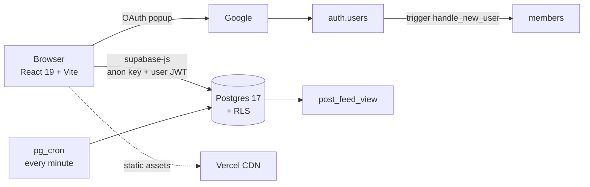

# AquaTerra — System Vault

> Every note here was written by reading the **live code** (`frontend/src`) and
> the **live Supabase schema** (project `hzowuwffjqtgszecngpe`) on
> **2026-08-10**. Where the repo's older `*.md` planning docs disagree with the
> code, the code wins and the note says so.

AquaTerra is a **student-run volunteer organisation in Kolkata** running a
**community social platform** — a moderated feed, member profiles, teams,
hiring, welfare-project CMS, a blog, and a 14-desk admin back office — plus a
separate annual-event sub-app (Paradox).

There is **no API server**. The React app talks to Postgres directly through
Supabase; *authorisation is Row-Level Security*, not middleware. That single
fact shapes everything else in this vault.

---

## The one-paragraph mental model

Read in this order if you are new:
1. [[Architecture Overview]] — the shape of the whole thing
2. [[Role Model]] — who can do what
3. [[Schema Overview]] — the 29 tables
4. [[Flow - Signup and Approval]] — the funnel that creates every user
5. [[Flow - Create Post and Moderation]] — the core content loop
6. [[HoD Desk Overview]] — the back office

---

## Map of content

### Architecture
- [[Architecture Overview]] · [[Supabase Clients]] · [[Service Layer Contract]]
- [[Routing Map]] · [[Caching Layers]] · [[Deployment and Vercel]]

### Data
- [[Schema Overview]] · [[RLS Policy Matrix]] · [[Views and RPCs]] · [[Triggers and Cron]] · [[Storage Buckets]]
- Tables: [[members]] · [[posts]] · [[post_feed_view]] · [[teams]] · [[blogs]] · [[welfare_projects]] · [[job_openings]] · [[notifications]] · [[external_achievements]] · [[Engagement Tables]] · [[Intake Tables]]

### Roles & permissions
- [[Role Model]] · [[Category Scoping]] · [[Permission Matrix]]

### User flows (end-to-end)
- [[Flow - Signup and Approval]]
- [[Flow - Create Post and Moderation]]
- [[Flow - Scheduled Publishing]]
- [[Flow - Blog Authoring]]
- [[Flow - Welfare Project Publishing]]
- [[Flow - Hiring and Applications]]
- [[Flow - Teams and Join Requests]]
- [[Flow - Achievements]]
- [[Flow - Engagement and Notifications]]
- [[Flow - Search and Discovery]]
- [[Flow - Public Visitor Journey]]

### HoD desk (back office)
- [[HoD Desk Overview]] · [[Desk - Queues]] · [[Desk - People]] · [[Desk - Intake]] · [[Desk - Admin Only]]

### Front end
- [[Two Design Languages]] · [[Component Library]] · [[Motion and Feedback]] · [[Image Pipeline]] · [[SEO and Meta]]

### Paradox
- [[Paradox Sub-App]]

### Improving it
- [[Simulation Log 2026-08-10]] — **read this before the other two.** 13 scenarios run against the live system; it corrected two claims in this vault and found a live PII exposure
- [[Known Gaps and Debt]] · [[Improvement Backlog]] · [[How to Add a Feature]]

- [[Fix Log 2026-08-10]] — what has been fixed, what is written and awaiting a paste into the SQL editor, and what is left as your decision

> [!check] All security findings are closed as of 2026-08-10
> `authenticated` could read **1314 member emails and 37 phone numbers** — the PII
> lockdown had never actually been applied. Fixed; that query now returns
> `permission denied`. The remaining ten fixes
> (`frontend/scripts/security_and_correctness_fixes_2026_08_10.sql`) are **applied
> and verified** too. What is left is decisions, not defects — see
> [[Fix Log 2026-08-10]].

---

## Ground truth, at a glance

| Thing | Value |
|---|---|
| Supabase project | `hzowuwffjqtgszecngpe` · `community-platform-aq` · ap-northeast-1 (Tokyo) · PG 17.6 |
| Public tables | 29, **all** with RLS enabled |
| Views | 4 (`post_feed_view`, `member_directory_view`, `pending_member_approvals`, `pending_post_reviews`) |
| Postgres functions | 24 (17 `SECURITY DEFINER`) |
| Cron jobs | 1 — `publish_due_scheduled_posts()` every minute |
| Storage buckets | 7 (4 public, 3 private/photobooth) |
| Live row counts | members 1343 · posts 586 · welfare_projects 558 · volunteer_applications 495 · blogs 36 |
| **Members who have ever signed in** | **41** — 1273 of 1314 "active" rows have `auth_uid IS NULL` |
| **Human-authored posts** | **0** — all 586 are welfare-project or blog mirrors |
| Leaders | 15 super_admin · 1 hod · 0 director · 0 team lead |
| Deploy | Vercel, builds `frontend/` only, output `frontend/dist` |
| Domain | `www.ngoaquaterra.com` |

> [!warning] The Tokyo region is a real latency tax
> Every read is a round-trip to `ap-northeast-1`. That is *why* [[Caching Layers]]
> exists (member cache, SWR cache, projects cache) rather than as premature
> optimisation.
