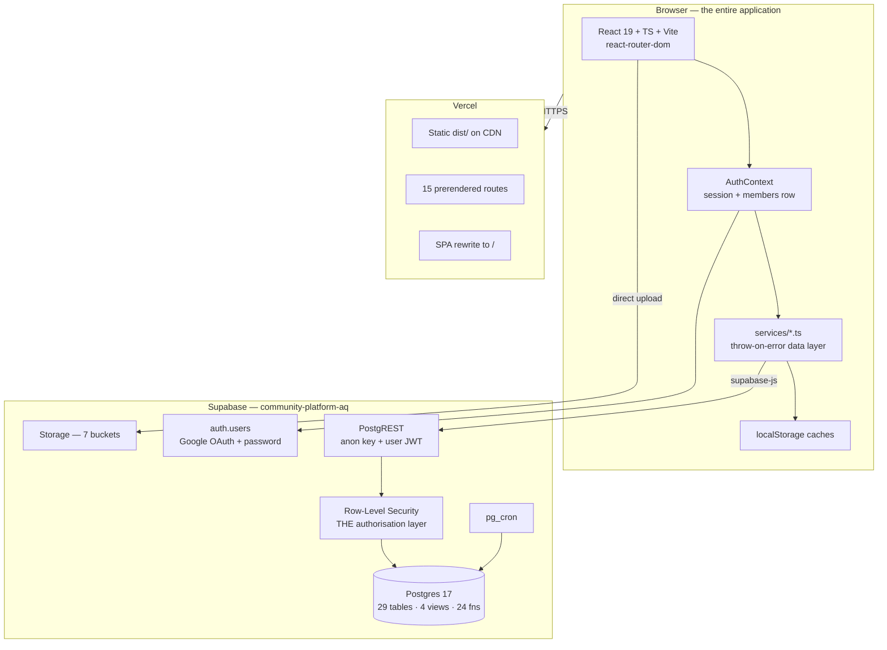

# Architecture Overview

## The shape of it

## Four things to internalise

### 1. There is no backend in the request path

A legacy Express + PostgreSQL `backend/` used to exist and **has been deleted**.
`frontend/src/services/api.ts` is now **type declarations only** — no Axios, no
HTTP client. Every read and write is `supabase-js` calling PostgREST from the
user's own browser with the user's own JWT.

Consequence: **you cannot hide a rule in application code.** If the browser can
ask for it, RLS is the only thing that can say no. See [[RLS Policy Matrix]].

### 2. Authorisation lives in Postgres, in five helper functions

`is_director()`, `is_super_admin()`, `is_assigned_to_category(cat)`,
`get_current_member_id()`, `current_member_id()` — all `SECURITY DEFINER`, all
resolving from `auth.uid()`. Policies compose from these rather than
re-implementing role checks. See [[Views and RPCs]].

The client-side mirror is `lib/roles.ts` ([[Role Model]]). The client copy
**only decides which UI renders**; a tampered client cache cannot read protected
rows.

### 3. Identity is two-headed: `auth.users` + `members`

Supabase owns the credential (`auth.users.id`, a uuid). AquaTerra owns the
person (`members.member_id`, an int). They are joined by `members.auth_uid`.
Almost every FK in the schema points at the **int** `member_id`, so nearly every
authenticated query needs a uuid to int hop — which is exactly what
`get_current_member_id()` and `lib/authCache.ts` exist for. See [[members]].

### 4. Content is one stream with four sources

`posts` is the primitive. Blogs, welfare projects and job openings are separate
editorial tables that **mirror themselves into `posts`** via triggers, then get
re-joined for display by `post_feed_view`. This is the single most distinctive
design decision in the codebase. See [[post_feed_view]] and
[[Flow - Create Post and Moderation]].

## Directory map (`frontend/src`)

| Folder | Role | Deep dive |
|---|---|---|
| `auth/` | Session, guards, login/register/pending/rejected, settings | [[Flow - Signup and Approval]] |
| `components/` | ~80 shared components, incl. 4 generative "studio" modals | [[Component Library]] |
| `director/` | The 14-desk back office | [[HoD Desk Overview]] |
| `feed/` | Post card, create modal, post page, notifications, saved, my-posts | [[Flow - Create Post and Moderation]] |
| `profile/` | Own + public profile, edit, achievements | [[Flow - Achievements]] |
| `public/` | 30+ marketing / CMS-consumer pages | [[Flow - Public Visitor Journey]] |
| `teams/` | Teams list, detail, join requests, team posts | [[Flow - Teams and Join Requests]] |
| `search/` | One unified search page | [[Flow - Search and Discovery]] |
| `services/` | 13 data modules, throw-on-error | [[Service Layer Contract]] |
| `lib/` | Clients, caches, roles, image sizing, profanity, jobOpenings | [[Caching Layers]] |
| `paradox/` | Self-contained event sub-app, own Supabase project | [[Paradox Sub-App]] |
| `styles/` | `tokens.css` + `v6.css` + per-route CSS | [[Two Design Languages]] |

## Where the older repo docs are wrong

| Doc | Claims | Reality (verified 2026-08-10) |
|---|---|---|
| `ARCHITECTURE.md` | Azure AD B2C + JWT middleware | Supabase Auth + Google OAuth, RLS |
| `CLAUDE.md` | "three separate Supabase projects" | **Two.** Community and CMS were consolidated; `lib/supabase.ts` is now literally `export const supabase = supabaseCommunity as any`. Paradox is the only genuinely separate project. See [[Supabase Clients]] |
| `scripts/welfare_projects_allow_admin_write_2026_07.sql` | `USING (true)` on UPDATE/DELETE, enforced by app routing only | Superseded — live policy is `is_director() OR is_super_admin()`. See [[welfare_projects]] |

Related: [[Deployment and Vercel]] · [[Routing Map]] · [[Known Gaps and Debt]]
