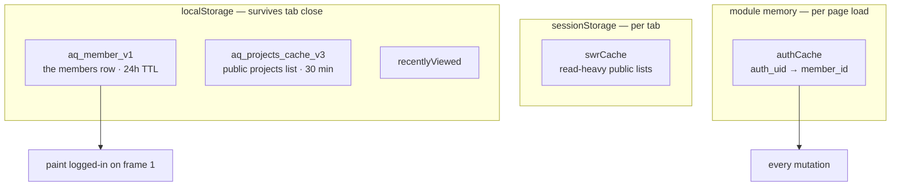

# Caching Layers

The database is in **Tokyo (`ap-northeast-1`)** and the users are in **Kolkata**.
Every read is a ~150 ms+ round-trip. Five distinct caches exist to hide that;
each solves a different failure it was actually observed causing.

## 1. Member cache — `aq_member_v1` (localStorage, 24h)

**Problem it solved:** `isAuthenticated` derives from the `members` row, so every
page load *blocked* on a Tokyo round-trip before it knew you were logged in. It
read as "slow", and when the fetch raced or stalled, as "signed in sometimes,
signed out other times / stuck on loading".

**How it works:** `AuthContext` hydrates state from localStorage
**synchronously** in the `useState` initialiser, so a returning user paints
logged-in on frame 1, then revalidates in the background.

Three guards make it safe:
- `hasSupabaseSession()` scans for an `sb-*-auth-token` key. No token means the
  cache outlived its session, so it is dropped — otherwise `/login` would treat
  a logged-out visitor as logged in and bounce them away.
- If the cached row's `auth_uid` differs from the live session's user, it is
  cleared before revalidating (shared browser / account switch).
- Past 24 h it is discarded and the network is awaited.

> [!note] Why a tampered cache is not a privilege escalation
> The client role only chooses **which UI renders**. All data access is RLS-gated
> server-side, and `ProtectedRoute` always reads the *current* context member,
> which `fetchMember()` overwrites when the network answers.

### The transient-failure rule (this is the important one)

`fetchMember` uses `.maybeSingle()` specifically to distinguish *zero rows* from
*a real error*. On any error — network blip, RLS hiccup, timeout — it **keeps**
the current member and returns. Nulling on transient failure is exactly what
surfaced as random mid-session logouts.

It also ignores `TOKEN_REFRESHED` and `USER_UPDATED` auth events: Supabase fires
those on a timer and on tab focus, and re-fetching on them was the main cause of
spurious "logouts".

Every await is wrapped in an 8 s `withTimeout`, and `isLoading` is always
cleared in a `finally` — an un-timed await here once meant a permanent spinner.

## 2. `authCache.ts` — uuid to member_id (module memory)

`getCachedMemberId()` memoises `auth_uid → member_id` for the page's lifetime and
**de-duplicates in-flight fetches** via a shared `_pendingFetch` promise. Almost
every mutation in `services/*` begins with this call, so without it a single
user action could fire the same lookup three or four times.

## 3. `swrCache.ts` — sessionStorage, stale-while-revalidate

`getCached<T>(key)` / `setCached<T>(key, data)`. Deliberately **session**Storage,
not local: per-tab, auto-clears on close, never serves stale data across
sessions. Used for read-heavy public lists so back-button navigation paints
instantly.

## 4. `projectsCache.ts` — localStorage, with explicit busting

`/projects` serves a localStorage snapshot instantly and only revalidates every
30 minutes. Great for visitors — but a director who just published a project
would keep seeing their own stale list for half an hour. So
`ProjectManager` calls `bustProjectsCache()` after **every** write.

> [!warning] Add a write, add a bust
> Any new code path that mutates `welfare_projects` must call
> `bustProjectsCache()`. Nothing enforces this.

## 5. `recentlyViewed.ts`

Local trail of recently viewed entities, feeding the related/recent surfaces.

## Edge caching (Vercel)

`/assets/*` and `/fonts/*` are `max-age=31536000, immutable` (hashed filenames);
images and video get 30 days. See [[Deployment and Vercel]].

## Cache invalidation summary

| Cache | Invalidated by |
|---|---|
| `aq_member_v1` | sign-out, missing session token, 24 h, `auth_uid` mismatch, any `fetchMember` success |
| `authCache` | `clearAuthCache()` when session is gone |
| `swrCache` | tab close |
| `aq_projects_cache_v3` | 30 min, or explicit `bustProjectsCache()` |

Related: [[Architecture Overview]] · [[Image Pipeline]] · [[Flow - Signup and Approval]]
