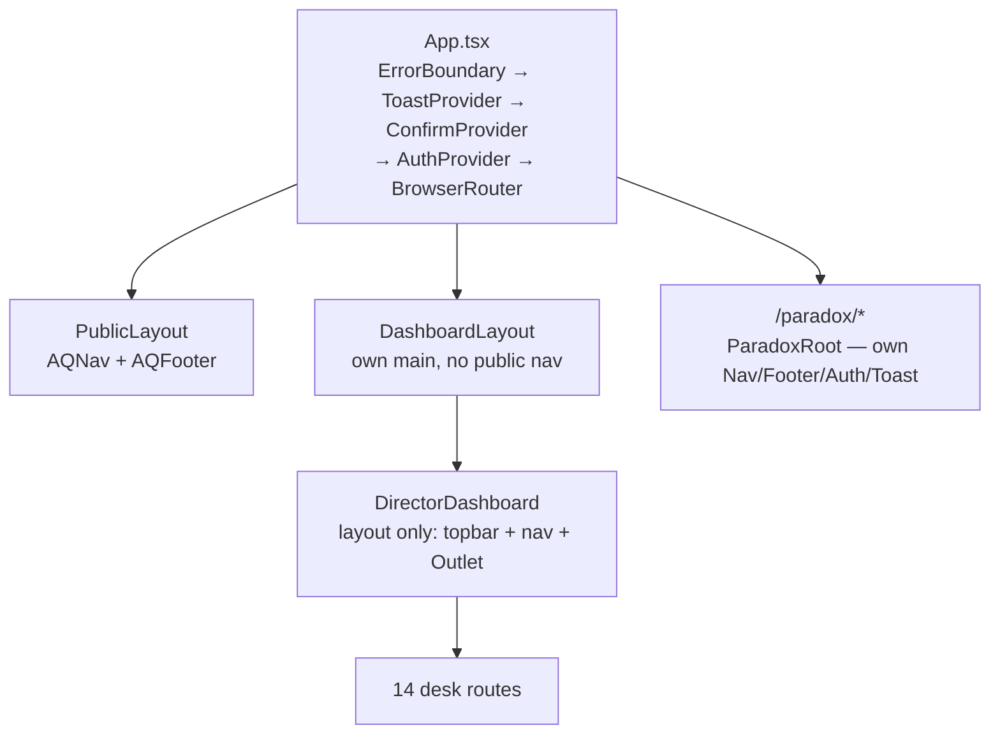
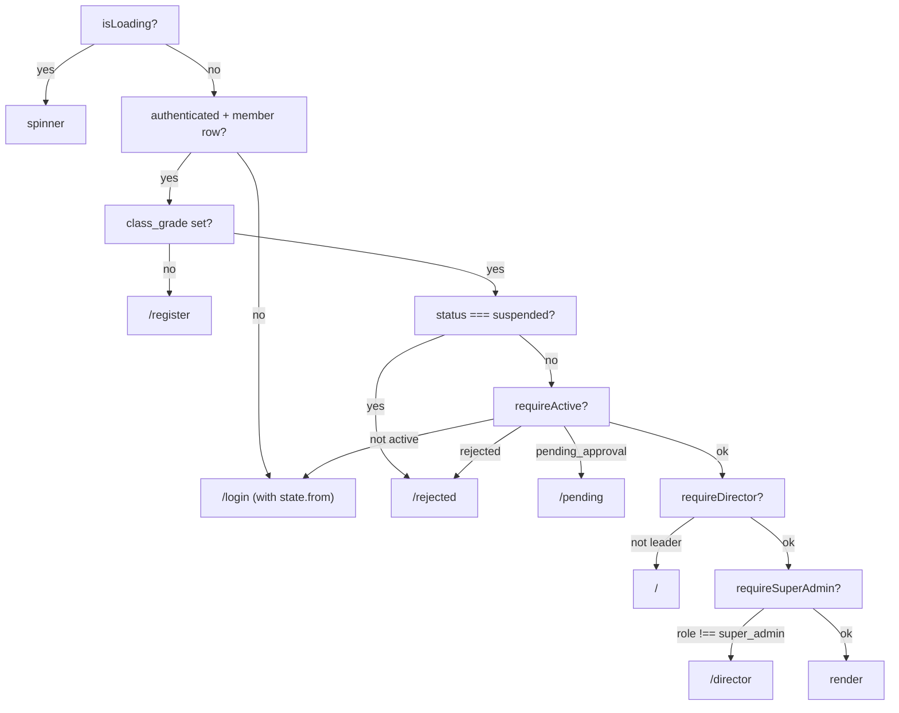

# Routing Map

One `BrowserRouter` in `App.tsx`. Every page except four is `lazy()`-loaded
through `lib/lazyWithRetry.ts` (a `React.lazy` wrapper that retries a failed
chunk fetch — deploys invalidate hashed chunk URLs mid-session).

Eager (needed on first paint): `ProtectedRoute`, `HomeRoute`, `PublicLayout`,
`DashboardLayout`.

## Layout shells



## Public routes (inside `PublicLayout`)

| Path | Page | Note |
|---|---|---|
| `/` | `HomeRoute` | **The feed is the home page.** `/feed` redirects here |
| `/projects`, `/projects/:slug` | `PublicProjectsPage`, `PublicProjectDetailPage` | CMS consumer, [[welfare_projects]] |
| `/blog`, `/blog/:slug` | `BlogListPage`, `BlogPostPage` | [[blogs]] |
| `/post/:uuid` | `PostPage` | Public permalink for any published post |
| `/member/:uuid` | `PublicProfilePage` | |
| `/members` | `MembersPage` | |
| `/teams`, `/teams/:uuid` | `TeamsPage`, `TeamDetailPage` | [[Flow - Teams and Join Requests]] |
| `/opportunities`, `/opportunities/:id` | `OpportunitiesPage`, `OpeningDetailPage` | [[Flow - Hiring and Applications]] |
| `/about` `/faq` `/contact` `/support` `/collaborations` `/schools` `/classes` `/crftd` `/links` `/volunteer` | marketing pages | |
| `/equity-policy` `/privacy-policy` `/thank-you` | policy + post-submit | |
| `/login` `/auth/callback` `/register` `/pending` `/rejected` | auth funnel | [[Flow - Signup and Approval]] |
| `/welcome` | `OnboardingPage` | **Unlisted** 5-step tour — not in nav, footer, or sitemap |
| `/brand` | `BrandPage` | **Unlisted** design-system reference |
| `/dev/components` | `ComponentGallery` | `import.meta.env.DEV` only, tree-shaken from prod |

## Redirects that exist for a reason

| From | To | Why |
|---|---|---|
| `/recruitment` | `/login` | **This is the link in the org's Instagram bio.** It used to 404, sending every prospective volunteer from social to "LOST IN THE FIELD." Do not remove without checking the bio |
| `/volunteer/apply` | `/login` | Self-registration retired — a first Google sign-in *is* the signup |
| `/everything-we-do` | `/projects` + preserved `#hash` | Page merged; keeps `#events` / `#welfare-projects` anchors alive |
| `/roots` | `/crftd` | ROOTS renamed to Crftd |
| `/feed` | `/` | Home became the feed |
| `/volunteer-handbook`, `/volunteer-handbook/edit` | `/volunteer` | |
| `/arcade/*` | `/` | Arcade hidden (tables still exist — [[Known Gaps and Debt]]) |

## Protected routes — `requireActive`

`/notifications` `/saved` `/my-posts` `/profile/me` `/profile/edit`
`/profile/:uuid` `/search` `/settings` — each wrapped in
`<ProtectedRoute requireActive><DashboardLayout/></ProtectedRoute>`.

## Director routes

```
/director                         ProtectedRoute requireDirector
  └── DirectorDashboard (layout)
        index          DirectorLanding
        approvals      AccountApprovals
        posts          PostModeration
        achievements   AchievementReviews
        blogs          BlogDrafts
        members        MemberDirectory
        categories     CategoryManagement
        teams          TeamManagement
        hiring         HiringResponses
        enquiries      FormResponses
        content        ProtectedRoute requireSuperAdmin → ContentManager
        projects       ProtectedRoute requireSuperAdmin → ProjectManager
        directors      ProtectedRoute requireSuperAdmin → DirectorManagement
        volunteers     ProtectedRoute requireSuperAdmin → VolunteerApplications
```

> [!danger] The double-gate invariant
> Every super-admin-only desk needs **both** a `superOnly: true` flag in
> `DirectorDashboard.NAV_GROUPS` *and* a per-route `requireSuperAdmin`. With only
> the nav flag, an hod/director reaches the screen by typing the URL. This has
> been a real shipped bug. See [[Permission Matrix]].

## `ProtectedRoute` decision order



Note `class_grade` — **not** `join_reason` — is the registration-complete
signal; the "what have you built" step was removed.

## Global behaviours bolted onto the router

- `ScrollToTop` — instant scroll reset on every pathname/search change
- `GlobalShortcuts` — `Cmd/Ctrl+K` to `/search` (suppressed while typing in an
  input/textarea/contentEditable), plus a Konami-code confetti easter egg and a
  console greeting
- `FirstRunController` — first-visit overlay orchestration
- `Suspense fallback` — a shared spinner using the global `spin` keyframe

Related: [[Deployment and Vercel]] · [[Role Model]] · [[HoD Desk Overview]]
