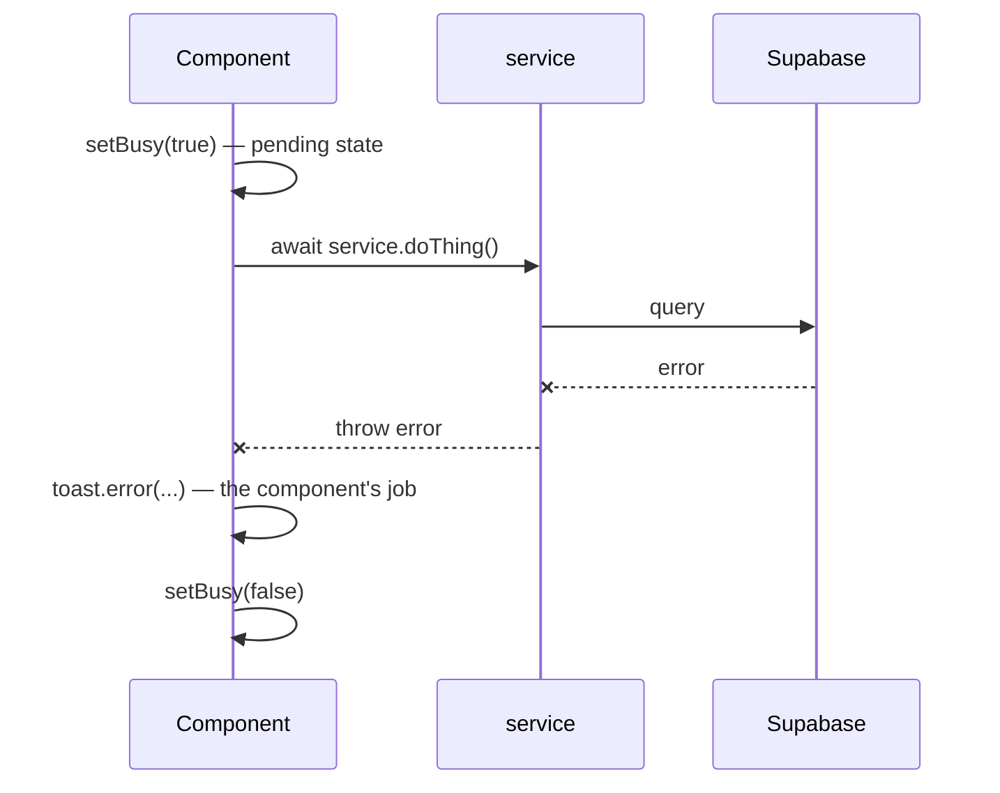

# Service Layer Contract

13 modules in `services/` plus `lib/jobOpenings.ts`. One rule, strictly held.

## The rule: services throw, components catch

Services **never** call `toast`. They `throw`. Every caller wraps in
`try/catch` and owns its own user-facing feedback ([[Motion and Feedback]]).

**One deliberate exception:** `notificationService.create()` is fire-and-forget
and non-throwing — a failed notification must not roll back the action that
triggered it.

## The 14 modules

| Module | Owns | Key surface |
|---|---|---|
| `feedService` | posts, likes, feed pagination, trending | `getFeed` `getPost` `createPost` `toggleLike` `getTrending` `getCategoryPulse` |
| `directorService` | the whole back office (769 lines) | `getDashboardStats` `getPendingApprovals` `approveMember` `rejectMember` `getPendingPosts` `approvePost` `rejectPost` `approvePostCategory` `getMemberDirectory` `getCategoryAssignments` `getMyCategories` `getAllDirectors` `assignCategory` `unassignCategory` `getEligibleMembers` `promoteToDirector` `demoteToMember` `changeRole` `deleteMember` `getScopedPendingPostsCount` |
| `teamService` | teams, membership, join requests, team posts (1051 lines) | `getTeams` `getTeam` `getMyTeams` `createTeam` `updateTeam` `deleteTeam` `addMember` `addMembersBulk` `updateMemberRole` `removeMember` `getPendingPosts` `getTeamPosts` `approvePost` `rejectPost` `createTeamPost` `createJoinRequest` `getJoinRequests` `approveJoinRequest` `rejectJoinRequest` `cancelJoinRequest` |
| `profileService` | own + public profile, avatar, member posts | `getOwnProfile` `updateProfile` `getPublicProfile` `getLifetimeLikes` `getMemberPosts` `getTaggedPosts` `uploadAvatar` |
| `achievementService` | achievements + review queue + share-as-post | `getMyAchievements` `getMemberAchievements` `createAchievement` `updateAchievement` `deleteAchievement` `getPendingReviews` `approveAchievement` `rejectAchievement` `shareAsPost` |
| `blogService` | drafts, slugging, publish | `makeSlug` `readMinutes` `create` `listDrafts` `publishDraft` `setDraftCover` `deleteDraft` |
| `notificationService` | in-app notifications | `list` `getUnreadCount` `markRead` `markAllRead` `create` *(non-throwing)* |
| `followService` | follow graph | `follow` `unfollow` `followByUuid` `isFollowing` `getCounts` `getFollowers` `getFollowing` |
| `savedPostsService` | bookmarks | `save` `unsave` `toggle` `getSavedSet` `getSavedPosts` |
| `searchService` | unified search | `search` `quickSearch` |
| `schoolService` | schools directory | `getSchools` `getSchool` `getSchoolMembers` `searchSchools` `createSchool` `updateSchool` |
| `lib/jobOpenings.ts` | openings, applications, status machine | `getAll` `getOpen` `fetchOpenFresh` `getById` `getByPostId` `create` `update` `transition` `pause` `resume` `close` `delete_` `createFromPost` `apply` `hasApplied` `getApplications` `updateApplicationStatus` |
| `directorServiceTypes` | shared types only | — |
| `api.ts` | **types only**, 150 lines, no client | historical artefact |

## Return-shape convention

Most methods return `{ success: true, data: … }` on the happy path **and still
throw** on failure. So `success` is not an error channel — it is a wrapper the
callers destructure. Do not write `if (!res.success)` as your error handling;
the `throw` is the error handling.

## Two shared caches every service leans on

- `lib/authCache.ts` → `getCachedMemberId()` memoises the uuid to `member_id`
  hop. Nearly every mutation starts with it.
- `lib/swrCache.ts` / `lib/projectsCache.ts` — stale-while-revalidate for lists.

See [[Caching Layers]].

## Retry

`lib/jobOpenings.ts` wraps its reads in a local `withRetry(...)`. No other
service does. That asymmetry is unexplained in the code and worth a decision —
see [[Improvement Backlog]].

Related: [[Supabase Clients]] · [[Motion and Feedback]] · [[HoD Desk Overview]]
