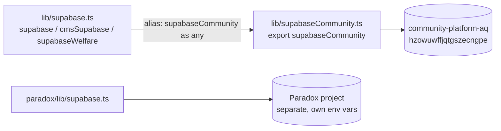

# Supabase Clients

Three import paths. **Two** actual projects.



## 1. `supabaseCommunity` — the real client

`lib/supabaseCommunity.ts`, 17 lines. Reads `VITE_SUPABASE_URL` /
`VITE_SUPABASE_ANON_KEY`. Persists the session. Used by `auth/`, `director/`,
and almost all of `services/*.ts`.

## 2. `supabase` — an alias, not a client

`lib/supabase.ts` historically created a **second, never-authenticating** client
(`persistSession: false`, `autoRefreshToken: false`) against a separate CMS
project. Since the 2026-07 consolidation it creates nothing:

```ts
export const supabase = supabaseCommunity as any
```

The module survives for (a) shared types and helpers — `WelfareProject`,
`Blog`, `normalizeObj` — and (b) its many existing importers
(`public/PublicProjectsPage.tsx`, `public/BlogListPage.tsx`,
`director/ProjectManager.tsx`, plus the `cmsSupabase` / `supabaseWelfare`
aliases).

> [!important] The consequence people trip on
> Because it is now an alias, **authenticated sessions apply to it.** A
> director's writes to `welfare_projects` / `blogs` carry their real JWT, and RLS
> gates those writes in the database. Anyone still reasoning about it as "the
> anon-only CMS client" gets the security model wrong in both directions.

## 3. Paradox client — genuinely separate

`paradox/lib/supabase.ts` reads `VITE_PARADOX_SUPABASE_URL` /
`VITE_PARADOX_SUPABASE_ANON_KEY`, **falling back to the community env vars if
unset**. Its ~45 `paradox_*` tables were confirmed *absent* from the community
project, so in the live deployment it points at its own project. See
[[Paradox Sub-App]].

## Rule when adding a query

**Check what the surrounding file already imports.** Mixing them fails
silently — you get an empty result set or a permission error rather than a type
error, because `supabase` is typed `any`.

| If you are in… | Import |
|---|---|
| `services/*`, most of `director/*`, `auth/*` | `supabaseCommunity` |
| `public/PublicProjectsPage`, `public/BlogListPage`, `director/ProjectManager` | `supabase` (same DB, `any`-typed) |
| anything under `paradox/` | the paradox client |

## The `any` tax

`supabase` being `as any` means **no type checking at all** on welfare-project
and blog queries — a renamed column shows up as `undefined` at runtime instead
of a build failure. That is a real, live risk surface; see
[[Known Gaps and Debt]].

Related: [[Architecture Overview]] · [[Service Layer Contract]] · [[Schema Overview]]
