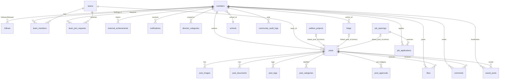

# Schema Overview

**29 public tables, all with RLS enabled. 4 views. 24 functions. 1 cron job.**
Postgres 17.6, `ap-northeast-1`.

## The whole graph

## Tables by purpose

### Identity and org (5)
| Table | Rows | Note |
|---|---|---|
| [[members]] | **1343** | the person; `member_id` int PK, `auth_uid` links to `auth.users` |
| `schools` | 0 | school directory — **built but unpopulated** |
| [[teams]] `teams` / `team_members` / `team_join_requests` | 8 / 3 / 2 | [[Flow - Teams and Join Requests]] |
| `director_categories` | 20 | category-scoped moderation, [[Category Scoping]] |
| `community_audit_logs` | 17 | super-admin-only audit trail |

### Content core (7)
| Table | Rows | Note |
|---|---|---|
| [[posts]] | **586** | the one content primitive |
| `post_images` | 0 | ordered image attachments |
| `post_documents` | 0 | PDF/PPTX, 15 MB bucket cap |
| `post_tags` | 0 | member tagging, fires notifications |
| `post_categories` | 0 | denormalised category, CHECK-constrained |
| `post_approvals` | 0 | per-category approval receipts |
| `comments` | 0 | **table + RLS exist; no UI ships** |

### Editorial sources that mirror into posts (3)
| Table | Rows | Note |
|---|---|---|
| [[welfare_projects]] | **558** | the project CMS |
| [[blogs]] | 36 | the blog CMS |
| [[job_openings]] | 5 | recruitment, plus `job_applications` (5) |

### Engagement (4)
`likes` (4) · `saved_posts` (2) · `follows` (1) · [[notifications]] (53).
See [[Engagement Tables]].

### Member-submitted (1)
[[external_achievements]] (3) — claims with a director review queue.

### Public intake (4)
`volunteer_applications` (**495**) · `legacy_volunteer_applications` (26) ·
`contact_submissions` (0) · `collaboration_submissions` (1). See
[[Intake Tables]].

### Arcade (2, dormant)
`arcade_scores` (0) · `arcade_trivia_questions` (30). The `/arcade/*` route
redirects home; the tables and 30 seeded questions remain. See
[[Known Gaps and Debt]].

## The five conventions that repeat everywhere

1. **Dual keys.** Most tables carry a serial `*_id` int PK *and* a `uuid`
   `UNIQUE` column. Ints are for FKs and joins; **uuids are what the URL and the
   client use** (`/post/:uuid`, `/member/:uuid`, `/teams/:uuid`). Never leak an
   int id into a URL.
2. **Soft delete on posts only.** `posts.deleted_at`; `post_feed_view` filters
   `deleted_at IS NULL`. `job_openings` also has `deleted_at` plus a
   `status='deleted'`.
3. **Status enums are `text`/`varchar` with CHECK constraints**, not PG enums —
   so adding a state is a CHECK change, not a type migration.
4. **`updated_at` by trigger**, via `update_updated_at_column()` /
   `set_teams_updated_at()` / `set_job_openings_updated_at()`.
5. **Timestamp types are inconsistent.** Older tables use
   `timestamp without time zone` (`members`, `posts`, `comments`, `likes`,
   `teams`, `external_achievements`); newer ones use `timestamptz`
   (`notifications`, `follows`, `saved_posts`, `job_*`, `schools`, `blogs`,
   `welfare_projects`). Some rows are written with `timezone('utc', now())` and
   others with `CURRENT_TIMESTAMP`. This is real, live drift — see
   [[Known Gaps and Debt]].

## Status vocabularies

| Table.column | Values |
|---|---|
| `members.status` | `pending_approval` · `active` · `rejected` · `suspended` |
| `members.role` | `member` · `lead` · `hod` · `director` · `super_admin` |
| `posts.status` | `pending_review` · `published` · `scheduled` · (`rejected`) |
| `external_achievements.status` | `pending` · `approved` · `rejected` |
| `job_openings.status` | `open` · `paused` · `closed` · `deleted` |
| `job_applications.status` | `pending` · … (director-updatable) |
| `team_join_requests.status` | `pending` · `approved` · `rejected` |
| `blogs` | no status column — **`published_date` is the state** |
| `welfare_projects` | `is_draft` boolean is the state (`status` text exists, unused) |
| intake tables | `new` · … |

The five content categories, everywhere: **`events` · `welfare` · `content` ·
`operations` · `labs`**. `lib/categories.ts` maps each to its department anchor
on `/projects`.

Related: [[RLS Policy Matrix]] · [[Views and RPCs]] · [[Triggers and Cron]] · [[Storage Buckets]]
