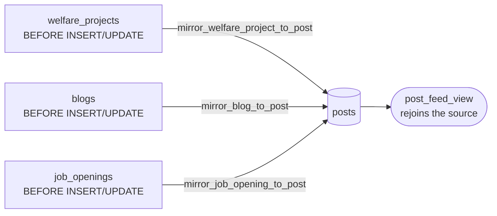
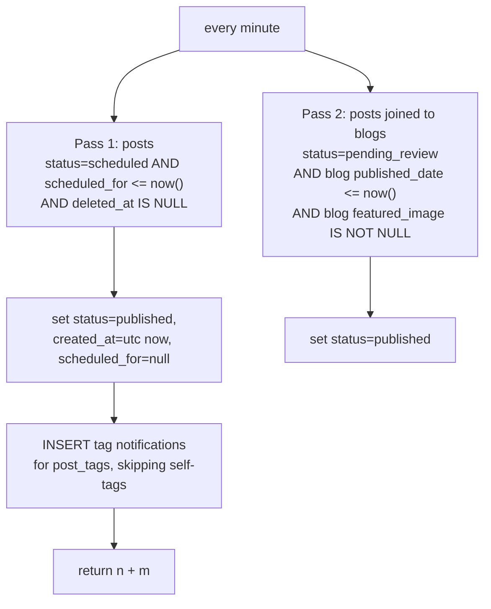

# Triggers and Cron

The parts of the system that run **without a user**. If behaviour appears with no
client code to explain it, it is almost certainly here.

## The three mirror triggers — content fan-in



All three are `BEFORE` triggers that set `NEW.linked_post_id` on the row being
written, and all three are **idempotent** — they only act when
`linked_post_id IS NULL`, so a project can be edited forever without spawning
duplicate posts.

All three insert with `author_id` resolved from
**`members WHERE email = 'official@ngoaquaterra.com'`**.

> [!danger] A single hardcoded email is a load-bearing dependency
> If that member row is renamed, re-emailed or deleted, `aq_member_id` comes back
> NULL and the INSERT fails `posts.author_id NOT NULL` — **every** project
> publish, blog publish and opening creation breaks at once. Nothing documents
> this in the app. See [[Known Gaps and Debt]].

### `mirror_welfare_project_to_post()`

Fires on the **draft to live transition**:
`(UPDATE AND OLD.is_draft AND NOT NEW.is_draft) OR (INSERT AND NOT NEW.is_draft)`.

Post body is `header + "\n\n" + short_summary`. Status: `published` immediately —
**no review step.** Category is inherited from `wp.category`.

### `mirror_blog_to_post()`

Fires whenever `linked_post_id IS NULL`, i.e. essentially at draft creation. It
builds the body via `blog_post_writeup(headliner, body, written_by)` and then
gates status on **three** conditions:

```
published_date IS NOT NULL
  AND published_date <= now()
  AND featured_image IS NOT NULL   ← the image is part of the gate
→ 'published'   else → 'pending_review'
```

The cover requirement is deliberate: a live blog with no cover renders as an
empty grey card in the feed. `author_id` prefers `NEW.author_id` (member-authored
drafts) and falls back to the official account.

### `mirror_job_opening_to_post()`

Fires when `status = 'open'` and `linked_post_id IS NULL`. Body is
`title + "\n\n" + description`. Status: `published` immediately.

> [!note] Asymmetry worth knowing
> Once created, the opening's post is **never updated** by the trigger. Editing
> the title or description afterwards leaves a stale feed post. The feed row
> disappears if the opening leaves `open` (via [[post_feed_view]]'s WHERE), but
> it does not come back accurate.

## Auth bootstrap

### `handle_new_user()` — trigger on `auth.users` INSERT

The **adopt-then-create** pattern:

1. `UPDATE members SET auth_uid = new.id, google_id, avatar_url, last_login`
   `WHERE auth_uid IS NULL AND lower(email) = lower(new.email)` — adopts a
   pre-created row.
2. If nothing was adopted, `INSERT` a fresh row with
   `status='pending_approval'`, `role='member'`, name resolved from
   `full_name` → `name` → the email local-part → `'Member'`.

### `ensure_member()` — the same logic as an RPC

Called by `AuthContext.fetchMember` when a valid session has **no** members row
(trigger missed it, row deleted). `members` has no INSERT policy, so this
`SECURITY DEFINER` RPC is the only client-reachable way to create one — and it
can only create the caller's own.

## `publish_due_scheduled_posts()` — the cron job

**`cron.job` id 1, `* * * * *` (every minute), active.**
`select public.publish_due_scheduled_posts();`

It does **two** things — the second is easy to miss:



Pass 1 rewrites `created_at` to the publish moment, so a scheduled post sorts as
new rather than as of its authoring time — correct for a feed.

Pass 2 is the **blog release mechanism**: a future-dated blog's mirrored post sits
in `pending_review` until its `published_date` arrives, then the cron promotes it.
That is why a blog appears in the feed with no director ever approving it.

Tag notifications are deliberately deferred to publish time — see
[[Flow - Scheduled Publishing]].

## Guard and housekeeping triggers

| Table | Trigger | Does |
|---|---|---|
| `members` | `members_guard_privileged_cols` | reverts `role` unless super admin; reverts `status`/`is_active`/`approved_*` unless director. See [[members]] |
| `external_achievements` | `trg_reset_achievement_status_on_owner_edit` | if the **owner** (and not a director) edits an approved/rejected achievement's substance, status resets to `pending` and review metadata clears. See [[Flow - Achievements]] |
| `members`, `posts`, `comments`, `external_achievements`, `schools` | `update_updated_at_column` | |
| `teams`, `team_join_requests` | `set_teams_updated_at` | |
| `job_openings` | `set_job_openings_updated_at` | |
| *(DDL)* | `rls_auto_enable` — an **event trigger** | auto-enables RLS on newly created tables. This is why all 29 tables have RLS on |

> [!tip] `rls_auto_enable` is a genuinely good guardrail
> A new table arrives with RLS **on and no policies**, i.e. deny-all — a loud
> failure instead of a silent leak. Expect a new table to return zero rows until
> you write policies.

Related: [[post_feed_view]] · [[Views and RPCs]] · [[Flow - Scheduled Publishing]] · [[RLS Policy Matrix]]
