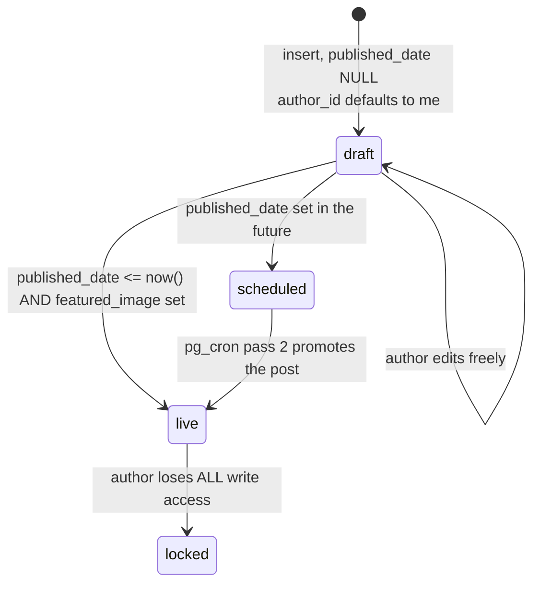

# `blogs`

The blog CMS — and the **only** table in the schema with a real member-authorship
model.

## Columns

| Column | Type | Note |
|---|---|---|
| `id` | int PK | |
| `slug` | text UNIQUE | `/blog/:slug` |
| `headliner` | text NOT NULL | the title |
| `body` | text | the article |
| `content` | text | second body field — **legacy/duplicate**, unclear which wins |
| `published_date` | timestamptz | **this is the state machine** |
| `featured_image` / `featured_image_alt` | text | the feed gate |
| `cover` / `cover_alt` | text | older cover fields; `post_feed_view` falls back to `cover` |
| `written_by` | text | display byline (free text) |
| `author_instagram` / `author_url` | text | |
| `minutes_of_read` | int | computed client-side by `blogService.readMinutes` |
| `category` | varchar NOT NULL default `content` | |
| `author_id` | int → `members` ON DELETE SET NULL, **DEFAULT `current_member_id()`** | the real authorship link |
| `linked_post_id` | uuid → `posts(uuid)` | the mirror |
| `created_at` | timestamptz | |

> [!note] Three overlapping content/image fields
> `body` vs `content`, and `featured_image` vs `cover`. The mirror trigger and the
> view read `body` and `COALESCE(featured_image, cover)`. Treat `content` and
> `cover` as legacy; confirm before deleting. See [[Improvement Backlog]].

## `published_date` is the state — there is no status column



Three distinct states out of one nullable timestamp:
- `NULL` → draft
- future → scheduled
- past → live

## The authorship model (the interesting part)

`author_id` **defaults to `current_member_id()`**, so a member's insert
self-attributes without the client passing an id. RLS then gives:

| Cmd | Policy |
|---|---|
| SELECT | (`published_date IS NOT NULL` ∧ `<= now()`) ∨ `is_director()` ∨ (author = me) |
| INSERT | `is_director()` ∨ (author = me ∧ author NOT NULL ∧ **`published_date IS NULL`**) |
| UPDATE | `is_director()` ∨ (author = me ∧ **`published_date IS NULL`**) |
| DELETE | `is_director()` ∨ (author = me ∧ **`published_date IS NULL`**) |

Read as a sentence: **a member may create and freely revise their own draft, and
loses all write access the instant it is published.** Only a director can publish
(setting `published_date`) or touch anything live.

This is what makes a member-facing blog composer possible without granting
director rights — and it is the cleanest permission design in the schema.

## Mirroring: two-stage, and the cover is a gate

`mirror_blog_to_post()` fires whenever `linked_post_id IS NULL`, i.e. at draft
creation — so **a post row exists from the moment the draft does**, sitting in
`pending_review` and invisible to the public.

Status gate, all three required for `published`:

```
published_date IS NOT NULL  AND  published_date <= now()  AND  featured_image IS NOT NULL
```

The cover requirement is deliberate: a live blog with no cover renders as an
empty grey card in the feed.

Then `publish_due_scheduled_posts()` **pass 2** (every minute) promotes any
`pending_review` blog-mirrored post whose blog has since gone live with a cover.
That is why a blog appears in the feed with no director ever pressing approve.

> [!warning] A blog with no `featured_image` never reaches the feed
> Not at publish, not at cron. The blog is live at `/blog/:slug` and simply absent
> from the stream, with no warning anywhere in the UI. `blogService.setDraftCover`
> exists precisely because of this; making the cover a required field in the
> composer would be better. See [[Improvement Backlog]].

## Slugging

`blogService.makeSlug(headliner)` normalises to a kebab base, then **queries
existing slugs** and de-duplicates against the taken set — so the UNIQUE
constraint is a backstop, not the mechanism. `readMinutes(body)` computes read
time client-side.

## Who touches it

| Surface | File |
|---|---|
| Public list / post | `public/BlogListPage.tsx`, `public/BlogPostPage.tsx` (via `supabase` alias) |
| Draft desk | `director/BlogDrafts.tsx` → `blogService.listDrafts/publishDraft/setDraftCover/deleteDraft` |
| Composer | `components/BlogStudioModal.tsx` + `BlogBlockEditor.tsx` + `blogGenerator.ts` |

Related: [[Flow - Blog Authoring]] · [[post_feed_view]] · [[Triggers and Cron]] · [[Desk - Queues]]
