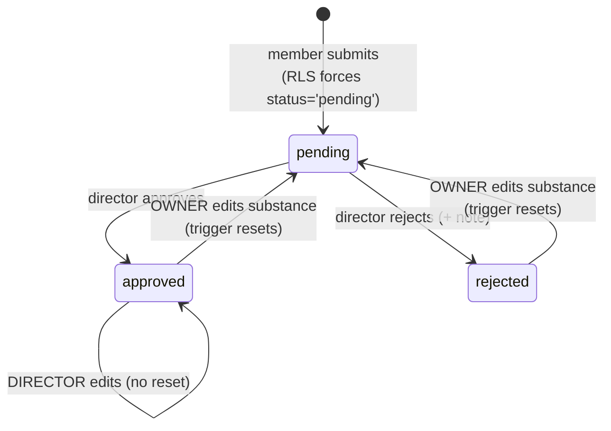

# `external_achievements`

Member-claimed achievements from outside AquaTerra, with a director review queue.
Small table, unusually well-designed lifecycle.

## Schema

`achievement_id` PK · `uuid` UNIQUE · `member_id` → `members` CASCADE NOT NULL ·
`title` NOT NULL · `description` · `achievement_type` default `other` ·
`achievement_date` / `achievement_end_date` date · `proof_url` ·
`status` NOT NULL default `pending` · `reviewed_by` → `members` SET NULL ·
`reviewed_at` · `review_note` · `created_at` / `updated_at`.

## Lifecycle



## Two mechanisms worth copying elsewhere

### 1. The INSERT policy makes "self-submit as pending" structural

```sql
CHECK (member_id = get_current_member_id()
       AND (is_director() OR status = 'pending'))
```

A member can only ever create a `pending` row for themselves. A director may
insert pre-approved. No client code needed to enforce it.

### 2. `reset_achievement_status_on_owner_edit()` — re-review on substantive edit

A BEFORE UPDATE trigger. If **the owner** (and not a director) changes any of
`title`, `description`, `achievement_type`, `achievement_date`,
`achievement_end_date` or `proof_url` on a row that was `approved` or `rejected`,
it sets `status = 'pending'` and clears `reviewed_by` / `reviewed_at` /
`review_note`.

> [!tip] This closes a bait-and-switch that most review systems have
> Without it, a member gets an innocuous claim approved and then rewrites it into
> something else, keeping the approved badge. The trigger's field list is the
> definition of "substantive" — it deliberately excludes nothing meaningful, and a
> director's own edits never trigger a reset.
>
> **This is the pattern [[posts]] lacks**: a post frozen at `published` cannot be
> edited at all, which is safe but blunt. Achievements found the better answer.

## RLS

| Cmd | Policy |
|---|---|
| SELECT | `status='approved'` (public) ∨ own ∨ `is_director()` |
| INSERT | own ∧ (director ∨ `status='pending'`) |
| UPDATE | own ∨ director *(then the reset trigger applies)* |
| DELETE | own ∨ director |

## Share as post

`achievementService.shareAsPost(uuid)` turns an achievement into a feed post. It
maps `achievement_type` to a post category via a local `categoryByType` record,
defaulting to `content`, then dynamically imports `feedService` and calls
`createPost`. So a member's shared achievement enters the normal moderation
queue — no special path.

## Surfaces

| Surface | File |
|---|---|
| Profile list | `profile/AchievementsList.tsx` |
| Add / edit | `profile/AddAchievementModal.tsx`, `EditAchievementModal.tsx` |
| Review queue | `director/AchievementReviews.tsx` — counted on the desk badge via `stats.pendingAchievementReviews` |

Related: [[Flow - Achievements]] · [[Desk - Queues]] · [[posts]]
