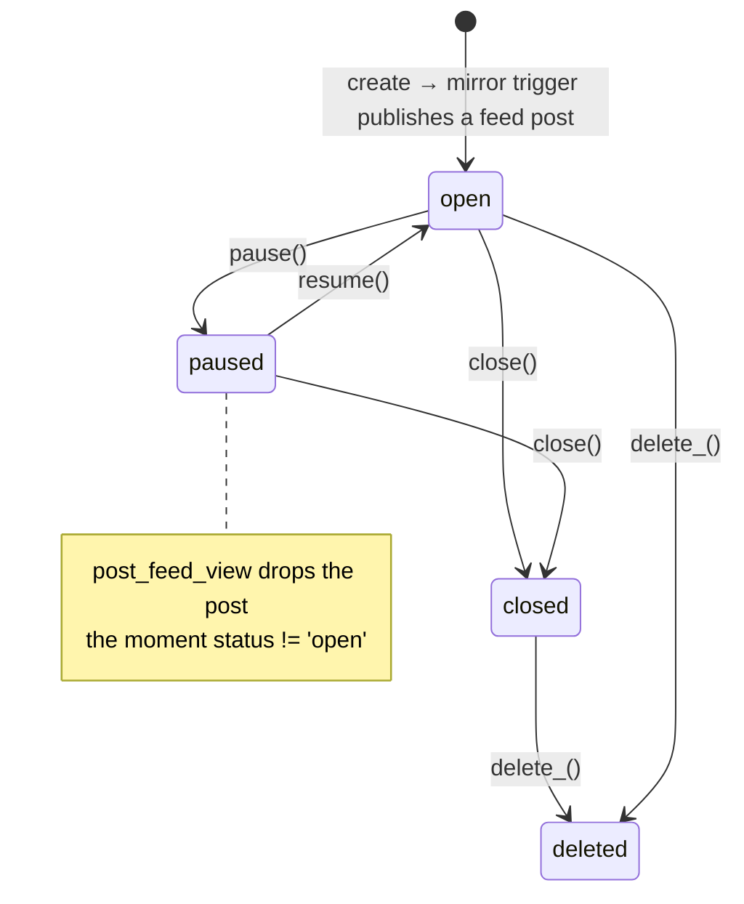

# `job_openings` and `job_applications`

Recruitment. The third mirror source, and the source of the codebase's most
cautionary migration story.

## `job_openings`

| Column | Note |
|---|---|
| `opening_id` int PK / `id` uuid UNIQUE | **the uuid is the FK target and the URL** (`/opportunities/:id`) |
| `title`, `description`, `category` | NOT NULL |
| `team_name` | free text, **not** a FK to `teams` |
| `skills` | text[] default `{}` |
| `commitment` | varchar |
| `deadline` | timestamptz |
| `status` | varchar default `open` |
| `closed_at`, `deleted_at` | timestamptz |
| `created_by_name`, `created_by_role` | **NOT NULL, denormalised strings** — not FKs to `members` |
| `custom_questions` | `jsonb` NOT NULL `[]` — per-opening application form |
| `linked_post_id` | uuid → `posts(uuid)` |

> [!note] Two odd modelling choices, both intentional-looking
> `created_by_name`/`created_by_role` are frozen text, so an opening keeps saying
> who posted it even if that member is deleted or demoted. And `team_name` is free
> text, so an opening can advertise a team that does not exist in `teams`. Both
> trade referential integrity for durability of the public record.

## The status machine

`lib/jobOpenings.ts` declares `ALLOWED_TRANSITIONS: Record<OpeningStatus,
OpeningStatus[]>` and exposes `pause()` / `resume()` / `close()` / `delete_()` as
named wrappers over `transition()`.



Two independent delete signals exist: `status = 'deleted'` (what the public
SELECT policy filters on) and `deleted_at`. `getAllIncludeDeleted()` is the
admin escape hatch.

The **transition guard is client-side only.** RLS permits any director to set any
status; nothing in the database enforces the state machine.

## `job_applications`

`id` uuid PK · `opening_id` → `job_openings(id)` CASCADE ·
`applicant_id` → `members` CASCADE · `applicant_name` / `applicant_email` /
`applicant_phone` (denormalised snapshot) · `message` ·
`custom_answers` jsonb NOT NULL `{}` · `status` default `pending` ·
`created_at` · **UNIQUE (opening_id, applicant_id)**.

`custom_answers` pairs with the opening's `custom_questions` — a dynamic form
built by `components/OpeningQuestionBuilder.tsx` and answered through
`OpeningPickerModal`.

### The RLS problem

```sql
-- INSERT
CHECK (auth.role() = 'authenticated')
```

> [!danger] Any authenticated user can insert an application as anyone
> Nothing ties the row to the caller — `applicant_id`, `applicant_name` and
> `applicant_email` are all client-supplied. A `pending_approval` account can
> apply, and can apply on someone else's behalf. `UNIQUE (opening_id,
> applicant_id)` is the only accidental backstop.
>
> It should be `CHECK (applicant_id = get_current_member_id())`. This is the
> single highest-value one-line security fix in the schema. See
> [[Known Gaps and Debt]].

SELECT is own-row **or** role ∈ (director, hod, super_admin) — hand-rolled inline
rather than calling `is_director()`, the same drift the codebase forbids in
TypeScript. UPDATE (status changes) is director-only. There is **no DELETE
policy** — an applicant cannot withdraw.

## The migration cautionary tale

`lib/jobOpenings.ts` referenced `job_applications` throughout for a long time
**before the table existed in the live database.** Every apply silently failed.
It exists now (5 rows), but the lesson stands:

> [!danger] A `.sql` file in the repo does not mean it has been applied
> See [[Deployment and Vercel]].

## Mirroring

`mirror_job_opening_to_post()` fires when `status='open'` and
`linked_post_id IS NULL`. Body = `title + "\n\n" + description`, published
immediately. It **never updates** afterwards, so an edited opening leaves a stale
feed post — though the post disappears entirely once status leaves `open`.

## UI surfaces

| Surface | File |
|---|---|
| Public list | `public/OpportunitiesPage.tsx` |
| Public detail + apply | `public/OpeningDetailPage.tsx` |
| Feed strip | `components/OpeningsStrip.tsx`, `HiringCard.tsx` |
| Compose / pick | `components/OpeningPickerModal.tsx`, `OpeningQuestionBuilder.tsx` |
| Admin | `director/HiringResponses.tsx` |

`CAT_COLORS`, `STATUS_COLORS`, `STATUS_LABELS` are exported from
`lib/jobOpenings.ts` — reuse them rather than re-deriving chips.

Related: [[Flow - Hiring and Applications]] · [[post_feed_view]] · [[Desk - Intake]]
