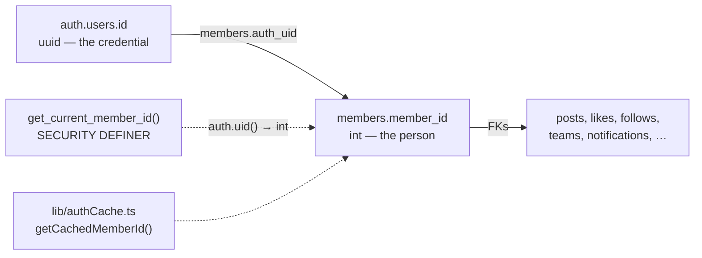

# `members`

The person. Everything hangs off this table.

## Columns

| Column | Type | Note |
|---|---|---|
| `member_id` | `serial` **PK** | what every FK in the schema points at |
| `uuid` | `uuid` UNIQUE | what URLs and the client use (`/member/:uuid`) |
| `auth_uid` | `uuid` UNIQUE → `auth.users(id)` | the credential link; **nullable** |
| `google_id` | `varchar` UNIQUE | OAuth `sub` / `provider_id` |
| `email` | `varchar` NOT NULL UNIQUE | **column-level locked down** |
| `full_name` | `varchar` NOT NULL | |
| `avatar_url` | `text` | Google picture or uploaded to `avatars` bucket |
| `class_grade` | `varchar` | **the registration-complete signal** |
| `phone` | `varchar` | **column-level locked down** |
| `join_reason` | `text` | legacy — no longer collected |
| `bio` | `text` | |
| `role` | `varchar` default `member` | [[Role Model]] |
| `status` | `varchar` default `pending_approval` | |
| `rejection_note` | `text` | |
| `approved_by` | int → `members` | |
| `approved_at` | `timestamp` | |
| `last_login` | `timestamp` | set by `handle_new_user` / `ensure_member` |
| `is_active` | `bool` default true | separate from `status` |
| `school_id` | int → `schools` ON DELETE SET NULL | |
| `created_at` / `updated_at` | `timestamp` (no tz) | `updated_at` by trigger |

## The dual-identity problem



`auth_uid` being **nullable** is deliberate: an admin can pre-create a member row
by email, and the first Google sign-in *adopts* it (see
[[Flow - Signup and Approval]]). It also means a row can exist with no
credential attached.

## PII column lockdown — INTENDED, but NOT LIVE

`scripts/members_pii_lockdown_2026_07_29.sql` is *meant* to revoke the
`authenticated` role's column grants on **`email`, `phone`, `auth_uid`,
`google_id`**, so that a plain `select('*')` on `members` fails for those columns.

> [!danger] Verified 2026-08-10: the revocation is not applied for `authenticated`
> `authenticated` still holds `SELECT` on all four columns. Combined with the
> "Anyone can view active members" policy, **any signed-in account can read 1314
> emails and 37 phone numbers in one query.** `anon` *is* correctly locked down
> (SELECT only on `full_name` and `bio`), so the migration landed partially or was
> undone by a later grant reset.
>
> ```sql
> REVOKE SELECT (email, phone, auth_uid, google_id) ON public.members FROM authenticated;
> ```
>
> The app keeps working after this — `get_own_member()` already exists. Subjects are
> students, many minors. See [[Simulation Log 2026-08-10]] SIM-1.

The rest of this section describes the behaviour the codebase **assumes** and is
written for. That defensive code is correct and should stay; the database needs to
catch up to it.

Consequences, both live in the code today:
- `AuthContext.fetchMember` calls the `get_own_member()` RPC instead of
  `select('*')`.
- `directorService.getCategoryAssignments()` / `getAllDirectors()` fetch emails
  through a **separate** privileged query and stitch them in via an
  `emailById` Map, rather than selecting the column inline.

> [!warning] Never add `select('*')` on `members`
> Use `get_own_member()` for the caller's own row, or an explicit column list
> that excludes the four locked columns.

## The privileged-column trigger

`members_guard_privileged_cols()` (BEFORE UPDATE, `SECURITY DEFINER`) enforces
in the database what the UI merely suggests:

- `role` is reverted to `OLD.role` unless the caller `is_super_admin()`. **Even
  directors and HoDs cannot change a role.**
- `status`, `is_active`, `approved_by`, `approved_at` are reverted unless the
  caller `is_director() OR is_super_admin()` (this is what permits the approvals
  flow).
- If `auth.uid()` is null (service role / direct SQL) the trigger no-ops.

This is why "Users can update own member row" being a broad `UPDATE` policy is
still safe — a member can edit their bio and avatar but cannot self-promote.

## RLS

| Cmd | Policy |
|---|---|
| SELECT | `status = 'active'` (public) **OR** `is_director()` **OR** `auth_uid = auth.uid()` |
| UPDATE | `is_director()` **OR** `auth_uid = auth.uid()` — then filtered by the trigger above |
| DELETE | `is_super_admin()` only |
| INSERT | **no policy** — impossible from the client. Rows come only from `handle_new_user()` (trigger on `auth.users`) or the `ensure_member()` RPC |

## Views over members

- `member_directory_view` — safe projection with a computed `role_rank` for
  sorting (no phone).
- `pending_member_approvals` — the approvals queue; *does* expose `phone` and
  `join_reason`, gated by the underlying policies.

## Live shape

1343 rows against 586 posts, 4 likes and 1 follow. Almost everyone in this table
is an **imported or pending record, not an engaged user.** Any product decision
about the feed should start from that number. See [[Improvement Backlog]].

Related: [[Role Model]] · [[Flow - Signup and Approval]] · [[RLS Policy Matrix]] · [[Views and RPCs]]
