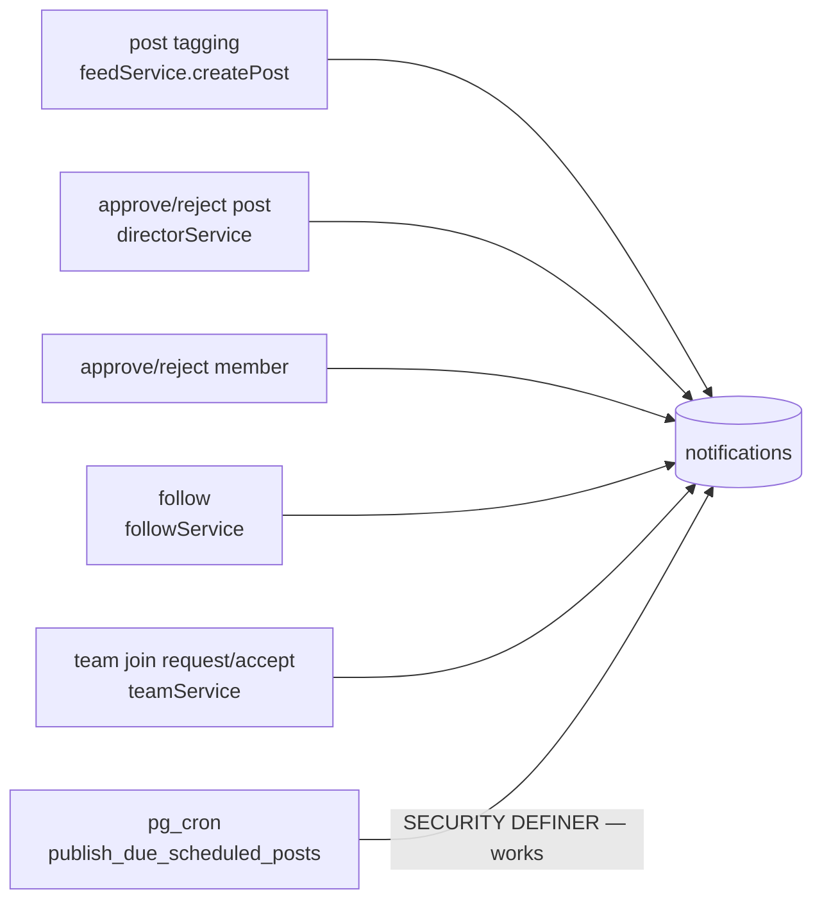

# `notifications`

In-app notifications. Read the RLS section — there is a live contradiction here.

## Schema

`id` uuid PK · `member_id` → `members` CASCADE NOT NULL (**the recipient**) ·
`type` text NOT NULL · `title` text NOT NULL · `subtitle` text ·
`full_note` text · `link` text · `is_read` bool NOT NULL false ·
`created_at` timestamptz NOT NULL.

Denormalised by design: the title is a pre-rendered sentence, not a template.
That makes rendering trivial and makes a notification **permanently reflect the
world at the moment it fired** — if a member renames themselves, old
notifications keep the old name. Acceptable, and deliberate.

## The ten types (`NotificationType`)

`like` · `comment` · `tag` · `follow` · `post_approved` · `post_rejected` ·
`team_invite` · `team_join_request` · `team_join_accepted` · `system`

`comment` and `team_invite` have no shipping producer — comments have no UI, and
invites are not implemented. So 8 of 10 are live at most.

## Service surface

`notificationService.list` · `getUnreadCount` · `markRead` · `markAllRead` ·
`create`.

`create()` is the **one sanctioned exception** to the
[[Service Layer Contract]]: it is fire-and-forget and **never throws**, because a
failed notification must not roll back the action that produced it.

## RLS — and the contradiction

| Cmd | Policy |
|---|---|
| SELECT | `member_id = get_current_member_id()` |
| UPDATE | `member_id = get_current_member_id()` |
| INSERT | **`auth.role() = 'service_role'`** |
| DELETE | none |

> [!check] The `service_role`-only INSERT policy is deliberate, and it works
> **Direct INSERT is revoked on purpose.** `notificationService.create()` does not
> insert — it calls the **`create_notification(...)` `SECURITY DEFINER` RPC**, which
> is the sole write path:
>
> ```ts
> await (supabaseCommunity as any).rpc('create_notification', {
>   p_member_id, p_type, p_title, p_subtitle, p_full_note, p_link })
> ```
>
> Verified live: 23 `post_approved`, 8 `like`, 1 `follow` rows exist — all
> client-originated types. See [[Simulation Log 2026-08-10]] SIM-3.
>
> Better still, the RPC (`security_hardening_2026_07.sql` M4) **splits the types by
> authority**: social types (`like`/`comment`/`follow`/`tag`/`team_join_request`) are
> open to any member, while authority types
> (`post_approved`/`post_rejected`/`team_invite`/`team_join_accepted`/`system`) are
> restricted to leaders — so a member cannot plant a fake "your post was approved"
> alert. It re-checks the internal-link rule server-side too.
>
> `create()` also skips self-notification (`me === input.memberId`) before calling.

> [!warning] The real issue: no dedup, so unlike/relike floods the author
> **8 `like` notifications against 4 rows in `likes`.** Unliking does not retract the
> notification, and nothing dedups on `(post, actor, type)` or applies a cooldown.
> A partial unique index, or a "last 24h" guard inside the RPC, closes it.

No DELETE policy means notifications accumulate forever. At 53 rows that is fine;
there is no retention or archival story.

## Producers (intended)



Note the cron path exists specifically because **scheduled posts defer their tag
notifications to publish time** — notifying someone about a post they cannot yet
open would dead-end. The tag rows are inserted immediately; only the notification
waits. See [[Flow - Scheduled Publishing]].

## Consumer

`feed/NotificationsPage.tsx` at `/notifications`, plus the bell in `AQNav` and the
director topbar using `getUnreadCount`.

Related: [[Flow - Engagement and Notifications]] · [[RLS Policy Matrix]] · [[Views and RPCs]]
