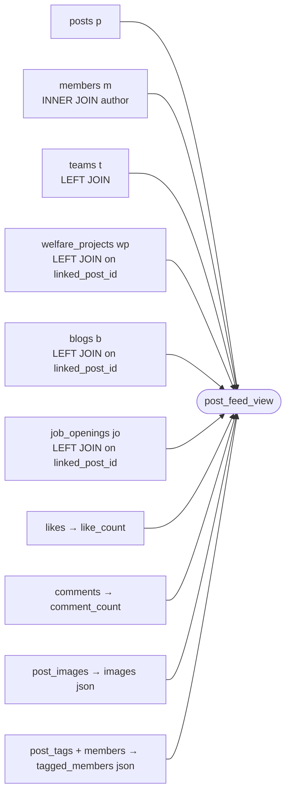

# `post_feed_view` — the content engine

**The most important object in the database.** Every feed, profile stream, team
stream, search result and post page reads from this view, not from `posts`.

It does four jobs at once: denormalise the author, count engagement, aggregate
attachments, and **re-attach the editorial source** a mirrored post came from.

## Shape



## The `WHERE` clause is doing real work

```sql
WHERE p.deleted_at IS NULL
  AND (jo.opening_id IS NULL OR jo.status = 'open')
```

- Soft-deleted posts vanish. **This is the only place that happens** — RLS does
  not filter `deleted_at`.
- A job-opening post **disappears from the feed the moment the opening stops
  being `open`**, without touching the post row. Pausing or closing a role
  silently retracts its feed presence. That is elegant and completely
  invisible from the `posts` table — remember it when debugging "my post
  disappeared".

## Source resolution — how a mirrored post gets its identity back

`source_type` is derived by which LEFT JOIN matched:

| Match | `source_type` |
|---|---|
| `welfare_projects` | `welfare_project` |
| `blogs` | `blog` |
| `job_openings` | `job_opening` |
| none | `NULL` (a plain member/team post) |

Then the coalesce ladder fills the display fields:

| View column | Comes from |
|---|---|
| `source_slug` | `COALESCE(wp.slug, b.slug)` — enables the deep link to `/projects/:slug` or `/blog/:slug` |
| `source_title` | `COALESCE(wp.header, b.headliner, jo.title)` |
| `source_author` | `b.written_by` |
| `source_location` | `wp.location` |
| `source_summary` | `wp.short_summary`, trimmed, empty to NULL |
| `source_stat` | `wp.key_statistic`, trimmed, empty to NULL |
| `source_date` | `wp.workshop_date` |

## Images: a three-tier fallback

```sql
COALESCE(
  (json_agg of post_images ORDER BY display_order),
  CASE
    WHEN welfare_project has non-empty main_image THEN [that]
    WHEN blog has non-empty featured_image or cover THEN [that]
    ELSE NULL
  END
)
```

So a mirrored post shows its **project cover or blog header** even though
`post_images` has no rows for it. This is why `post_images` is at 0 rows while
the feed still renders imagery.

## Stats: literal, else derived from the project

```sql
COALESCE(
  NULLIF(p.stats, '[]'),
  CASE WHEN welfare_project THEN <derived> ELSE NULL END
)
```

The derived branch is the cleverest — and most fragile — SQL in the codebase. For
a welfare project it builds up to two stat blocks:

1. **Volunteers.** If `wp.volunteers > 0`, emit
   `{value: volunteers, label: 'volunteer' | 'volunteers'}` — singular/plural
   handled in SQL.
2. **Key statistic.** If `wp.key_statistic` *starts with a digit* **and** is
   ≤ 40 characters, split it with regex:
   - `value` = `regexp_match(key_statistic, '^\s*(\d[\d,]*\+?)')` — leading
     number, optional commas, optional trailing `+`
   - `label` = the remainder, with the leading number stripped and trailing
     `.`/`!` removed

> [!warning] The failure mode is silent and content-authored
> `"1,200+ students reached"` yields `{1,200+ | students reached}`. But
> `"Reached 1200 students"` yields **nothing** (does not start with a digit), and
> a 41-character statistic yields nothing. Editors have no way to know why their
> stat did not render. Any fix belongs in the CMS field's help text as much as in
> the SQL. See [[Improvement Backlog]].

## Full column list

`post_id` `uuid` `category` `body` `link_url` `link_title` `link_image` `status`
`created_at` `updated_at` `pinned` `pinned_title` `author_id` `author_uuid`
`author_name` `author_avatar` `author_role` `team_uuid` `team_name` `like_count`
`comment_count` `images` `tagged_members` `source_type` `source_slug`
`source_title` `source_author` `source_location` `featured` `stats`
`scheduled_for` `source_summary` `source_stat` `source_date`

## Client-side column sets

`services/profileService.ts` exports `POST_FEED_COLS` — the shared select list.
`feedService` extends it into `POST_DETAIL_COLS` for the single-post page. Use
those constants; do not hand-roll a select list.

## Performance note

`like_count` and `comment_count` are **correlated subqueries per row**, and
`images` / `tagged_members` are per-row `json_agg` subqueries. At 586 posts and 4
likes that is free. It will not stay free — this is the first thing to watch as
engagement grows. See [[Improvement Backlog]].

Related: [[posts]] · [[welfare_projects]] · [[blogs]] · [[job_openings]] · [[Triggers and Cron]]
