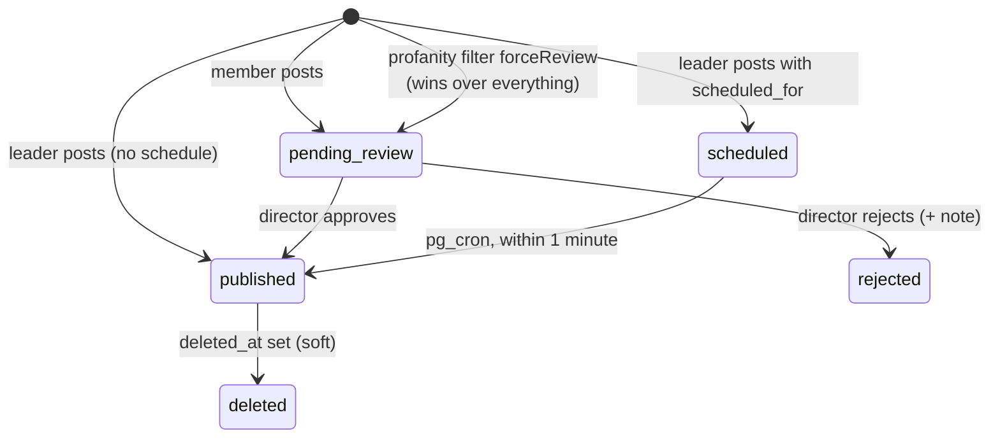

# `posts`

The single content primitive. Member posts, team posts, mirrored blogs, mirrored
welfare projects and mirrored job openings are **all rows in this table**.

## Columns

| Column | Type | Note |
|---|---|---|
| `post_id` | `serial` **PK** | FK target |
| `uuid` | `uuid` UNIQUE | the permalink `/post/:uuid`, and the mirror link target |
| `author_id` | int → `members` ON DELETE CASCADE, NOT NULL | mirrored rows are authored by `official@ngoaquaterra.com` |
| `team_id` | int → `teams` ON DELETE SET NULL | set for team posts |
| `category` | `varchar` NOT NULL | `events`/`welfare`/`content`/`operations`/`labs` |
| `body` | `text` NOT NULL | |
| `link_url` / `link_title` / `link_image` | `text` | link preview |
| `status` | `varchar` default `pending_review` | `pending_review` · `published` · `scheduled` · `rejected` |
| `rejection_note` | `text` | |
| `reviewed_by` | int → `members` | |
| `reviewed_at` | `timestamp` | |
| `pinned` | `bool` NOT NULL false | |
| `pinned_title` | `text` | |
| `featured` | `bool` NOT NULL false | |
| `stats` | `jsonb` NOT NULL `[]` | up to 2 `{value,label}` stat blocks |
| `scheduled_for` | `timestamptz` | leaders only; the cron reads this |
| `deleted_at` | `timestamptz` | **soft delete** |
| `created_at` / `updated_at` | `timestamp` (no tz) | |

## Status machine



### Who gets auto-published — `feedService.createPost`

```
isLeader = role in (director, hod, super_admin)

status = forceReview            ? 'pending_review'
       : scheduledFor           ? 'scheduled'
       : isLeader               ? 'published'
       :                          'pending_review'
```

Two rules the code documents as unbreakable:

1. **`forceReview` always wins.** It is set when the profanity filter flags the
   text. Scheduling must never become a way to bypass moderation.
2. **Never silently downgrade a schedule into an instant publish.** Image and
   document uploads run *before* the insert and can take minutes, so a time that
   was valid in the UI may already have passed. It stays `scheduled`, and the
   cron publishes it within a minute — which matches what the author was told.

## Attachment inserts are best-effort and parallel

After the post row lands, `post_images`, `post_documents`, `post_tags` and
`post_categories` are inserted in a single `Promise.all`, each with its own
`.then` that only `console.warn`s on failure. A failed attachment **does not**
roll back the post.

`post_categories` failures on codes `23505` (unique) and `23514` (check) are
swallowed entirely — the table has a CHECK on the five-category allow-list and a
`UNIQUE (post_id, category)`.

> [!note] This is a deliberate tradeoff with a visible cost
> A post can publish with its images silently missing. There is no repair job and
> no user-facing signal. See [[Improvement Backlog]].

## Reading posts: always via the view

Clients never assemble a feed row by hand — they select from
[[post_feed_view]], which joins the author, team, counts, images, tags and the
three mirror sources.

## RLS

| Cmd | Policy |
|---|---|
| SELECT | `status = 'published'` (public) **OR** `author_id = get_current_member_id()` **OR** `is_director()` |
| INSERT | `author_id = get_current_member_id()` **AND** that member's `status = 'active'` |
| UPDATE | (`author_id = me` **AND** `status = 'pending_review'`) **OR** `is_director()` |
| DELETE | `author_id = me` **OR** `is_director()` |

Two things follow. An author can edit a post only **while it is pending** — once
published or rejected it is frozen to them. And `deleted_at` is not enforced by
RLS; a soft-deleted published post is still SELECT-able, it is
`post_feed_view`'s `WHERE` clause that hides it. **Querying `posts` directly
will show deleted rows.**

Related: [[post_feed_view]] · [[Flow - Create Post and Moderation]] · [[Flow - Scheduled Publishing]] · [[Engagement Tables]]
