# `welfare_projects`

The project CMS, and **the largest content table** (558 rows vs 586 posts). One
row is one field project / workshop / drive; it renders as a card on `/projects`,
a detail page at `/projects/:slug`, and a mirrored post in the feed.

## Columns

| Group | Columns |
|---|---|
| Identity | `id` int PK · `slug` text UNIQUE · `category` NOT NULL default `welfare` |
| State | `is_draft` bool default **true** · `featured` bool · `status` text *(exists, unused)* |
| Header | `header` NOT NULL · `short_summary` · `objective` · `long_writeup` |
| Facts | `location` · `key_statistic` · `workshop_date` timestamptz · `volunteers` int |
| Main image | `main_image` · `main_image_alt` |
| Gallery | `image_1..4` + `image_N_alt` + `label_N` — **four fixed slots, not a child table** |
| Collaborator | `collab_logo` · `collab_logo_alt` · `collab_name` |
| Links | `instagram_link` · `google_drive_link` |
| Mirror | `linked_post_id` → `posts(uuid)` ON DELETE SET NULL |
| Meta | `created_at` timestamptz |

> [!note] Four hardcoded image slots
> `image_1..image_4` with parallel `_alt` and `label_` columns means the gallery
> is capped at four and every consumer unrolls the same four-way repetition. A
> `project_images` child table (like `post_images`) is the obvious normalisation —
> it is also a 558-row migration and a rewrite of every consumer. See
> [[Improvement Backlog]].

## `is_draft` is the state, and it is a one-way door

```mermaid
stateDiagram-v2
  [*] --> draft : insert (is_draft default true)
  draft --> live : is_draft = false
  note right of live
    mirror trigger fires HERE
    creates a published post
    sets linked_post_id
  end note
  live --> live : edits (no new post; feed post NOT updated)
```

`mirror_welfare_project_to_post()` fires on
`(UPDATE AND OLD.is_draft AND NOT NEW.is_draft) OR (INSERT AND NOT NEW.is_draft)`
and only when `linked_post_id IS NULL`. So:

- Publishing creates **one** post, `status='published'` — **no review step.**
- Flipping back to draft does **not** delete or unpublish the post. The project
  vanishes from `/projects` (RLS hides drafts from the public) while its feed post
  stays live. **This is the clearest content-lifecycle gap in the system.** See
  [[Known Gaps and Debt]].
- Editing a live project never refreshes the feed post's body — though
  [[post_feed_view]] re-reads `header`, `short_summary`, `main_image`,
  `key_statistic` and `location` live at query time, so most of what the feed
  card *displays* does stay current. Only the stored `posts.body` goes stale.

## How it reaches the feed

`post_feed_view` LEFT JOINs on `linked_post_id` and supplies:
- `source_type = 'welfare_project'`, `source_slug` → deep-link to `/projects/:slug`
- `source_title` from `header`, `source_summary` from `short_summary`,
  `source_location`, `source_stat` from `key_statistic`, `source_date` from
  `workshop_date`
- the **image fallback**: `main_image` becomes the post's image when
  `post_images` has no rows
- **derived stats**: `volunteers` and a regex-parsed `key_statistic`. The parsing
  rules (must start with a digit, ≤ 40 chars) are in [[post_feed_view]] — worth
  reading before writing CMS copy.

## RLS

| Cmd | Policy |
|---|---|
| SELECT | `is_draft IS NOT TRUE` **OR** `is_director()` **OR** `is_super_admin()` |
| INSERT / UPDATE / DELETE | `is_director() OR is_super_admin()` |

Note `is_draft IS NOT TRUE` (not `= false`) — a NULL `is_draft` is publicly
visible. The column has a default but no NOT NULL.

## Who touches it

| Surface | File | Client |
|---|---|---|
| Public list | `public/PublicProjectsPage.tsx` | `supabase` (alias) |
| Public detail | `public/PublicProjectDetailPage.tsx` | `supabase` |
| Admin CRUD | `director/ProjectManager.tsx` + `ProjectManagerShared.tsx` + `ProjectModal.tsx` | `supabase` |

All three use the `any`-typed alias, so **none of these queries are
typechecked**. See [[Supabase Clients]].

`ProjectManager` must call `bustProjectsCache()` after every write, or a director
sees their own stale list for up to 30 minutes ([[Caching Layers]]).

Related: [[Flow - Welfare Project Publishing]] · [[post_feed_view]] · [[Triggers and Cron]] · [[Desk - Admin Only]]
