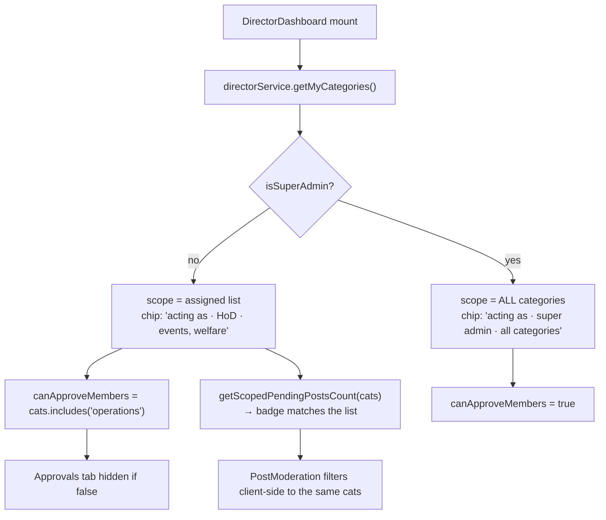

# Category Scoping

A second, orthogonal axis of authority: **which subject areas** a director or HoD
may moderate. 20 live assignment rows.

## The five categories

`events` · `welfare` · `content` · `operations` · `labs`

They are the same five values used by `posts.category`, `teams.category`,
`job_openings.category`, `welfare_projects.category` and `blogs.category`.
`lib/categories.ts` maps each to its department anchor on `/projects`:

```ts
events → events · welfare → welfare-projects · content → social-media
operations → collabs · labs → shikshaq
```

## `director_categories`

`assignment_id` PK · `member_id` → `members` CASCADE · `category` varchar ·
`assigned_at` · `assigned_by` → `members` · **UNIQUE (member_id, category)**.

RLS: SELECT for any director; INSERT/DELETE **super admin only**. So a director
can see the whole assignment map but cannot change their own scope.

Managed at `/director/categories` (`CategoryManagement.tsx`) via
`directorService.getCategoryAssignments` / `assignCategory` / `unassignCategory`.

## How scope propagates through the desk



## Two non-obvious consequences

### `operations` is the member-approval permission

`canApproveMembers = isSuperAdmin || cats.includes('operations')`. Account
approvals are treated as an operations function, so the **Approvals tab is hidden
entirely** from a director scoped only to, say, `events`. The gate is duplicated
in `AccountApprovals`' own check — and the dashboard comment says explicitly that
the two must mirror each other.

### The badge must match the list

`getScopedPendingPostsCount(cats)` exists because a scoped director otherwise saw
the **global** pending count on the tab and a smaller list once they opened it.
Fixed by counting with the same filter the list applies. If you add a scoped
queue, add the scoped count with it.

> [!warning] Scoping is enforced in the client, not in RLS
> `posts` SELECT is `author=me ∨ is_director()` — **no category clause.** So a
> category-scoped HoD can read *every* pending post via the API, and
> `directorService.approvePost(postId)` will happily approve one outside their
> scope. `PostModeration` filters the list **client-side**.
>
> The one place scoping *is* enforced in the database is `post_approvals`'
> INSERT policy (`is_assigned_to_category(category)`) — and that path is unused,
> 0 rows, and broken for `hod`. See [[RLS Policy Matrix]] and [[Views and RPCs]].
>
> If category scoping is meant to be a real boundary rather than a UI convenience,
> that is a policy change: add a category clause to `posts` UPDATE for
> non-super-admins. See [[Improvement Backlog]].

## Assignment surface

| Action | Method | Who |
|---|---|---|
| See the map | `getCategoryAssignments()` | any director |
| See my own scope | `getMyCategories()` | self |
| Assign | `assignCategory(memberId, category)` | super admin |
| Unassign | `unassignCategory(memberId, category)` | super admin |

`getCategoryAssignments()` also demonstrates the PII workaround: it fetches
member emails in a **separate** query and stitches them in via an `emailById`
Map, because `members.email` is revoked at the column level ([[members]]).

Related: [[Role Model]] · [[Permission Matrix]] · [[Desk - People]] · [[Flow - Create Post and Moderation]]
