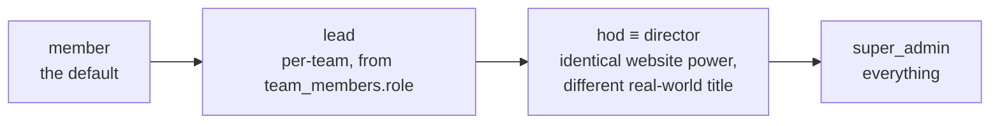
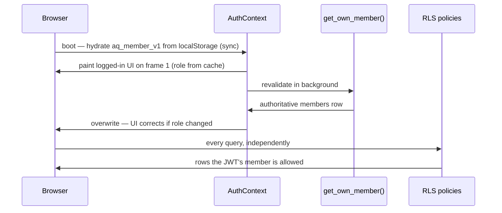

# Role Model

Five global roles plus one per-team role. Checked through `lib/roles.ts` on the
client and `is_director()` / `is_super_admin()` in the database — **never
hand-rolled inline**.



## The two rules that must not be broken

### 1. `hod` and `director` are equivalent — always test both together

```ts
export const LEADER_ROLES = ['director', 'hod', 'super_admin'] as const
export function hasLeaderAccess(role?): boolean   // any of the three
export function isSuperAdmin(role?): boolean      // role === 'super_admin'
```

> [!danger] Never write `role === 'hod' || role === 'director'` inline
> Use `hasLeaderAccess()`. The database mirror is `is_director()`, which accepts
> all three. Every place that hand-rolls the list has drifted — see
> `job_applications` and `volunteer_applications` in [[RLS Policy Matrix]], and
> `is_assigned_to_category()` in [[Views and RPCs]], **which omits `hod`
> entirely** and is a live bug.

### 2. Two gates for every super-admin surface

A `superOnly: true` flag in `DirectorDashboard.NAV_GROUPS` hides the tab. A
per-route `<ProtectedRoute requireSuperAdmin>` in `App.tsx` blocks the URL. **You
need both.** With only the flag, a director types `/director/projects` and walks
in. This has shipped as a real bug before. See [[Permission Matrix]].

## `lead` is not a global role

`members.role` can be `'lead'`, and `getRoleLabel` renders it as "Team Lead" —
but every actual lead **capability** in RLS derives from
`team_members.role = 'lead'` for the specific team:

```sql
EXISTS (SELECT 1 FROM team_members tm
        WHERE tm.team_id = <table>.team_id
          AND tm.member_id = get_current_member_id()
          AND tm.role = 'lead')
```

So a person can lead team A and be a plain member of team B, regardless of their
global `members.role`. And note the check ignores `is_active` / `left_at` — a
departed lead keeps the powers until their row is deleted. See [[teams]].

## Where role comes from at runtime



> [!important] The client role is a rendering hint, not a permission
> A user editing `aq_member_v1` to `super_admin` in localStorage sees admin tabs
> and gets **empty results and permission errors**, because RLS re-derives the role
> from `auth.uid()` server-side on every query. Client checks exist to avoid
> showing controls that would fail — that is all they are for.

## Display helpers

| Helper | Returns |
|---|---|
| `getRoleLabel(role)` | `Super Admin` · `HoD` · `Director` · `Team Lead` · `Member` |
| `getRoleClass(role)` | `role-director` (hod/director/super_admin) · `role-lead` · `role-member` |

Note `getRoleClass` collapses all three leader roles to one chip style — the UI
does not visually distinguish an HoD from a super admin except in the desk topbar,
which prints `SUPER ADMIN` or `HOD`.

## Role changes

`directorService.changeRole(memberId, role)` and
`promoteToDirector` / `demoteToMember`. All of them are ultimately gated by
`members_guard_privileged_cols()`, which reverts `NEW.role` to `OLD.role` unless
the caller `is_super_admin()`. **A director cannot promote anyone, including
themselves** — enforced in Postgres, not in the UI. See [[members]].

`lib/roles.ts` is one of only three files with unit tests (`roles.test.ts`).

Related: [[Permission Matrix]] · [[Category Scoping]] · [[RLS Policy Matrix]] · [[HoD Desk Overview]]
