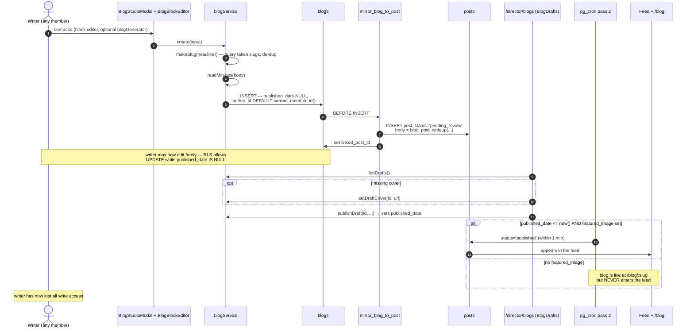

# Flow — Blog Authoring

The only member-authorable long-form content, with the cleanest permission model
in the schema — and a four-step build that is partly unfinished.

## The path



## The permission model, in one sentence

**A member may create and freely revise their own draft, and loses all write
access the instant it is published.**

```sql
INSERT: is_director() OR (author_id = current_member_id() AND published_date IS NULL)
UPDATE: is_director() OR (author_id = current_member_id() AND published_date IS NULL)
DELETE: is_director() OR (author_id = current_member_id() AND published_date IS NULL)
SELECT: (published_date IS NOT NULL AND <= now()) OR is_director() OR author_id = me
```

`blogs.author_id` **defaults to `current_member_id()`**, so the client never has
to pass an author. Publishing is director-only because it means setting
`published_date`.

This is the mechanism that makes a member-facing composer possible without
granting director rights. Reuse the pattern.

## Three states from one nullable timestamp

| `published_date` | State | Public sees | Feed |
|---|---|---|---|
| `NULL` | draft | no | no (post is `pending_review`) |
| future | scheduled | no | no, until cron pass 2 |
| past | live | yes | **only if `featured_image` is set** |

## The cover is a hard gate — twice

`mirror_blog_to_post()` requires `featured_image IS NOT NULL` to publish the
post, and `publish_due_scheduled_posts()` pass 2 requires it again. The rationale
is in the trigger's own comment: a live blog with no cover renders as an empty
grey card in the feed.

> [!warning] A coverless blog is live and invisible, with no warning
> `/blog/:slug` works. The feed never shows it. Nothing in the composer or the
> drafts desk says why. `blogService.setDraftCover` exists as the remedy; making
> the cover **required in the composer** would be the actual fix. See
> [[Improvement Backlog]].

`post_feed_view` falls back to `COALESCE(featured_image, cover)` for *display* —
but the publish gates check `featured_image` **only**. So a blog with `cover` set
and `featured_image` null is stuck.

## The composer

| File | Role |
|---|---|
| `components/BlogStudioModal.tsx` | the composing shell |
| `components/BlogBlockEditor.tsx` | block-based body editing |
| `components/blogGenerator.ts` | generative drafting assist |
| `components/TemplatePicker.tsx` | starting templates |

Sibling generative studios exist for other formats:
`PosterStudioModal` + `posterGenerator.ts`, `CarouselStudioModal` +
`carouselGenerator.ts`, `StoryGenerator.ts`. See [[Component Library]].

## Field ambiguity to resolve

`body` vs `content`, and `featured_image` vs `cover`. The trigger and view read
`body` and `COALESCE(featured_image, cover)`; treat `content` and `cover` as
legacy but **confirm against the 36 live rows before deleting**. See [[blogs]].

## Build status

Per the project's own notes this is a four-step build: **step 1 shipped**, and
step 3 is blocked on a blogs-RLS decision. The RLS read above is what is *live*
now — a genuinely workable member-authorship model — so the blocking question is
probably narrower than it was when it was recorded. Worth re-opening.

Related: [[blogs]] · [[Flow - Scheduled Publishing]] · [[Desk - Queues]] · [[post_feed_view]]
