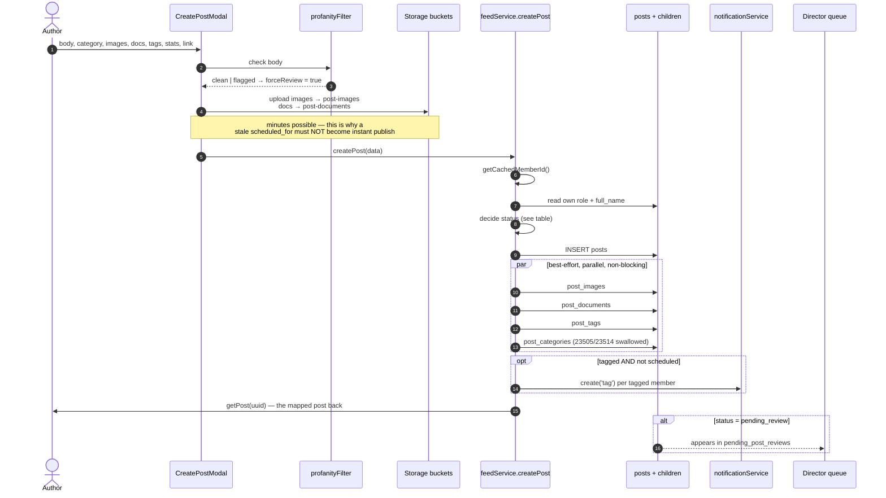
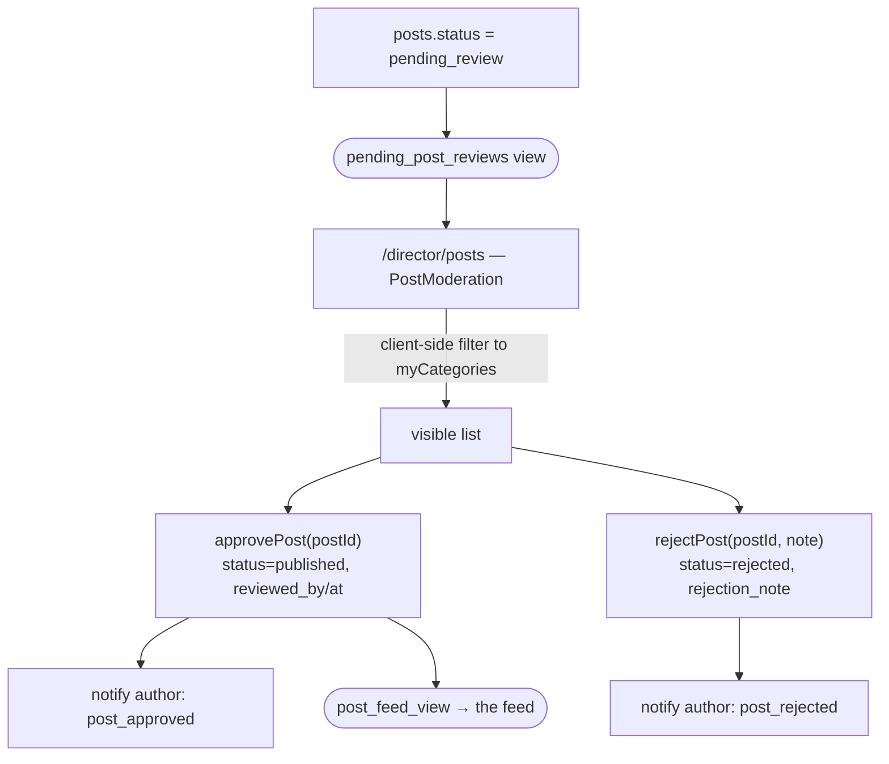
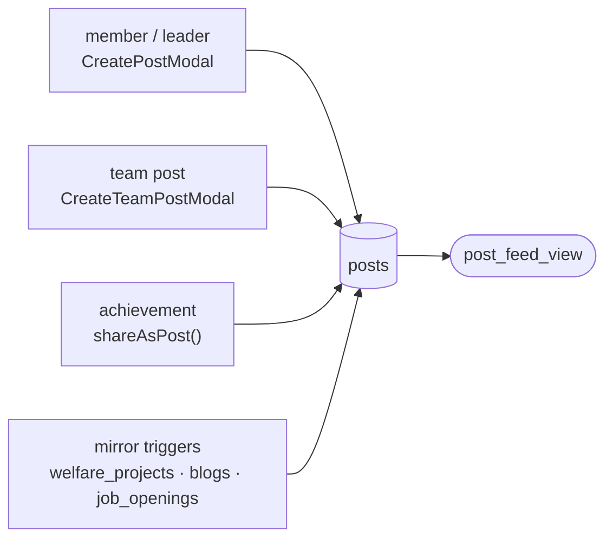

# Flow — Create Post and Moderation

The core loop of the product.

## Compose to publish



## The status decision

```
isLeader = role in (director, hod, super_admin)

forceReview            → 'pending_review'     ← always wins
else scheduledFor set  → 'scheduled'          ← leaders only
else isLeader          → 'published'
else                   → 'pending_review'
```

> [!danger] Two invariants the code calls out explicitly
> **1. `forceReview` beats everything.** It is set by the profanity filter. If
> scheduling could override it, scheduling becomes a moderation bypass.
> **2. Never downgrade a schedule to an instant publish.** Uploads run first and
> can take minutes; a `scheduled_for` that has already passed stays `scheduled`, and
> pg_cron publishes it within a minute. Firing immediately would contradict what
> the author was told.

## Attachments are best-effort

All four child inserts run in one `Promise.all`, each `.then`-ing to a
`console.warn` on failure. **A failed image insert does not roll back the post.**

Consequence: a post can go live with its images silently missing, with no repair
job and no user-facing signal. See [[Improvement Backlog]].

## Moderation



The badge count uses `getScopedPendingPostsCount(cats)` so the number on the tab
matches the list behind it — see [[Category Scoping]].

> [!warning] Category scoping here is client-side only
> `posts` SELECT/UPDATE is `is_director()` with **no** category clause. A scoped
> HoD can read and approve any pending post through the API; `PostModeration`
> merely filters the list it renders. See [[Permission Matrix]].

## The second, parallel moderation queue

`teamService` has its **own** `getPendingPosts` / `approvePost` / `rejectPost`
for **team posts** (`posts.team_id` set), surfaced in `TeamDetailPage` for team
leads. Both queues write the same `posts.status`.

> [!note] Nothing coordinates the two
> A team post pending review appears in **both** the team lead's queue and the
> director queue. Either can approve it. There is no lock, so the second approver
> just re-approves an already-published post. Benign today; worth knowing.

## The four ways a post comes into existence



Mirrored posts **skip moderation entirely** — the welfare and job triggers insert
with `status='published'` directly. Only human-authored posts see the queue. See
[[Triggers and Cron]].

## Reading it back

Never query `posts` for display. `feedService.getFeed({page, limit, category})`
selects from `post_feed_view` using `POST_FEED_COLS`, then:

1. in parallel, fetches the caller's `likes` for the returned `post_id`s and the
   `post_documents` rows
2. maps rows through `mapPostFromDB(post, likedPostIds)` so each card knows
   whether *you* liked it
3. returns `{posts, totalItems, totalPages}`

`getPost(uuid)` uses the wider `POST_DETAIL_COLS`. `getTrending({limit, days})`
and `getCategoryPulse({days})` are windowed aggregates over the same view.

## Profanity filter

`lib/profanityFilter.ts` + `profanityWords.json`, unit-tested
(`profanityFilter.test.ts`). It does **not** block — it sets `forceReview`, which
routes the post to a human. Leaders are not exempt.

Related: [[posts]] · [[post_feed_view]] · [[Flow - Scheduled Publishing]] · [[Desk - Queues]] · [[Category Scoping]]
