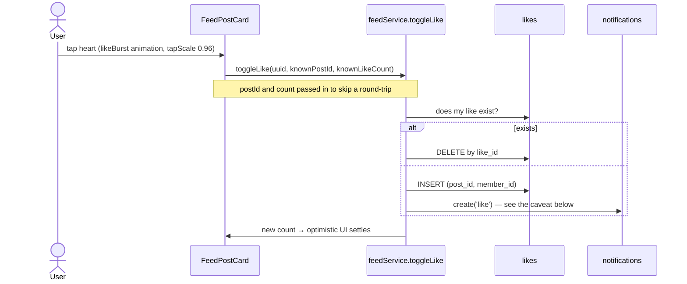
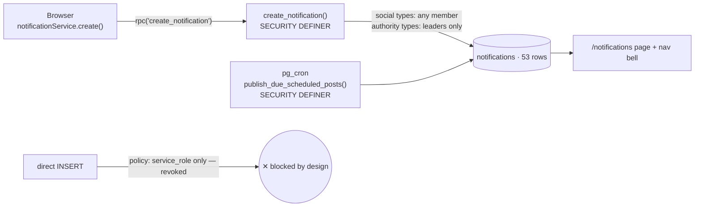

# Flow — Engagement and Notifications

The social layer: like, save, follow, tag, notify. **Fully built, essentially
unused** — 4 likes, 2 saves, 1 follow, 0 comments against 586 posts and 1343
members.

## Like

`UNIQUE (post_id, member_id)` makes double-liking impossible at the database
level. `likes` SELECT is `USING (true)` — who liked what is public.

## Save (bookmark)

`savedPostsService.save` / `unsave` / `toggle` / `getSavedSet` / `getSavedPosts`.
`saved_posts` SELECT is **own-rows-only** — unlike likes, bookmarks are private.
`getSavedSet` fetches the whole set once so a rendered list can mark its saved
items without one query per card. Surfaced at `/saved`.

## Follow

`followService.follow` / `unfollow` / `followByUuid` / `unfollowByUuid` /
`isFollowing` / `getCounts` / `getFollowers` / `getFollowing`.

The uuid wrappers exist because the client works in uuids while `follows` stores
ints. `follows` SELECT is public. There is **no self-follow constraint** in the
database — only the client prevents `follower_id = followee_id`.

Following does **not** filter the feed. `getFeed` is chronological across all
published posts, optionally filtered by category. So the follow graph is currently
decorative: it drives counts and a notification, nothing else. See
[[Improvement Backlog]].

## Tag

Tagged members are written to `post_tags` at post creation and drive a `tag`
notification. For **scheduled** posts the notification is deliberately deferred to
publish time by pg_cron, so the link never dead-ends — see
[[Flow - Scheduled Publishing]].

`post_tags` SELECT is `USING (true)`, so tags on a still-pending post are
world-readable. Minor leak, noted in [[RLS Policy Matrix]].

## Comment — the table exists, the UI does not

Full table, full RLS, an `updated_at` trigger, a `comment_count` subquery in
[[post_feed_view]], and a `comment` notification type. **No comment UI ships
anywhere in `frontend/src`.** So every card renders a permanent `0`.

Ship it or hide the count. See [[Improvement Backlog]].

## Notifications — read this before building on them

> [!check] Verified working — and the design is the best in the schema
> The `service_role`-only INSERT policy is not a contradiction: direct INSERT is
> **deliberately revoked**, and `notificationService.create()` goes through the
> `create_notification(...)` RPC. Live counts confirm it — 23 `post_approved`, 8
> `like`, 1 `follow`.
>
> The RPC encodes what RLS cannot: **social** types
> (`like`/`comment`/`follow`/`tag`/`team_join_request`) are open to any member, while
> **authority** types (`post_approved`/`post_rejected`/`team_invite`/
> `team_join_accepted`/`system`) are leader-only — so a member cannot forge a "your
> post was approved" alert. It re-checks the internal-link rule server-side, and
> `create()` skips self-notification before calling.
>
> See [[Simulation Log 2026-08-10]] SIM-3.

> [!warning] Unlike/relike floods the author
> **8 `like` notifications against 4 rows in `likes`.** Unliking leaves the
> notification behind, and nothing dedups on `(post, actor, type)`. A partial unique
> index or a 24-hour guard in the RPC fixes it.

## Consumption

`notificationService.list` / `getUnreadCount` / `markRead` / `markAllRead`, read
at `/notifications` (`feed/NotificationsPage.tsx`) and by the nav bell. Own-row
SELECT and UPDATE only. **No DELETE policy** — notifications accumulate forever,
with no retention story.

## Feedback conventions on every one of these actions

Per the codebase's own standard, every mutation must show a pending/disabled
state, a success confirmation, and an **explicit** error — never a silent console
log. Primitives: `useToast()` and `useConfirm()`. See [[Motion and Feedback]].

Optimistic UI is used for like and save (the count moves before the round-trip
settles), which is right for a Tokyo-region database.

## The real question this flow raises

Every mechanism works, and nobody uses it. 1343 members produced 4 likes. The
operational funnel actually runs through **WhatsApp** ([[Intake Tables]] tracks
`texted` / `added`). Before adding engagement features, work out whether the
answer is distribution rather than product. See [[Improvement Backlog]].

Related: [[Engagement Tables]] · [[notifications]] · [[post_feed_view]] · [[Motion and Feedback]]
