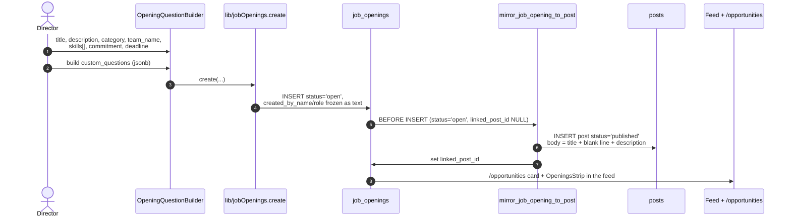
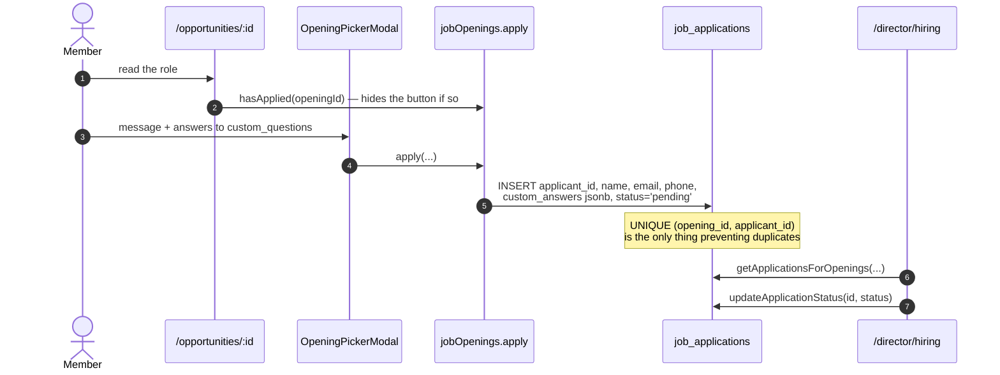
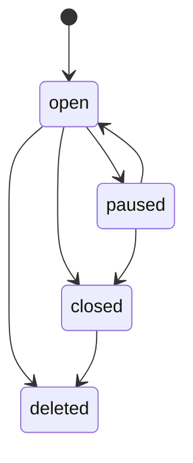

# Flow — Hiring and Applications

Openings are the third mirror source, and applications carry the schema's most
serious permission gap.

## Posting an opening



## Applying



## The security gap

```sql
-- job_applications INSERT policy
CHECK (auth.role() = 'authenticated')
```

> [!danger] Any signed-in user can create an application as anyone
> `applicant_id`, `applicant_name`, `applicant_email` and `applicant_phone` are all
> client-supplied and **nothing ties the row to the caller**. So:
> - a `pending_approval` account, never approved by anyone, can apply
> - a member can submit an application **in another member's name**
> - the only accidental guard is `UNIQUE (opening_id, applicant_id)`
>
> One-line fix:
> ```sql
> ALTER POLICY job_applications_auth_insert ON job_applications
>   WITH CHECK (applicant_id = get_current_member_id());
> ```
> This is the highest-value security change available in the schema. See
> [[Known Gaps and Debt]].

Also: SELECT and UPDATE on this table **hand-roll** the role list
(`role = ANY(ARRAY['director','hod','super_admin'])`) instead of calling
`is_director()` — the same drift the codebase forbids in TypeScript. And there is
**no DELETE policy**, so an applicant cannot withdraw.

## The status machine — client-enforced only

`ALLOWED_TRANSITIONS` in `lib/jobOpenings.ts`, with `pause()` / `resume()` /
`close()` / `delete_()` wrapping `transition()`.



RLS lets any director set any status — the state machine lives entirely in the
client. Two independent delete signals coexist: `status='deleted'` (what the
public SELECT policy filters) and `deleted_at`. `getAllIncludeDeleted()` is the
admin view.

## The retraction side effect

`post_feed_view`'s WHERE clause is
`(jo.opening_id IS NULL OR jo.status = 'open')`.

> [!important] Pausing or closing a role silently removes its feed post
> No `posts` row is touched. The post still exists, `/post/:uuid` still resolves,
> but the feed drops it. Resuming brings it back. This is elegant — and completely
> invisible if you are debugging from the `posts` table. See [[post_feed_view]].

The trigger also **never updates** the mirrored post. Editing an opening's title
or description leaves a stale feed post that will not correct itself.

## Custom questions

`job_openings.custom_questions` (jsonb array) pairs with
`job_applications.custom_answers` (jsonb object). Built by
`OpeningQuestionBuilder.tsx`, rendered by `OpeningPickerModal.tsx`. There is **no
schema validation** on either side — a question shape change silently orphans old
answers.

## Surfaces

| Surface | File |
|---|---|
| Public list | `public/OpportunitiesPage.tsx` |
| Public detail + apply | `public/OpeningDetailPage.tsx` |
| Feed strip / card | `components/OpeningsStrip.tsx`, `HiringCard.tsx` |
| Admin | `director/HiringResponses.tsx` |

Reuse the exported `CAT_COLORS`, `STATUS_COLORS`, `STATUS_LABELS`.

## Historical note

`lib/jobOpenings.ts` referenced `job_applications` for a long time before the
table existed live — every apply failed silently. It exists now (5 rows).
Cross-check the live schema, never the `.sql` files. See
[[Deployment and Vercel]].

Related: [[job_openings]] · [[post_feed_view]] · [[Desk - Intake]] · [[RLS Policy Matrix]]
