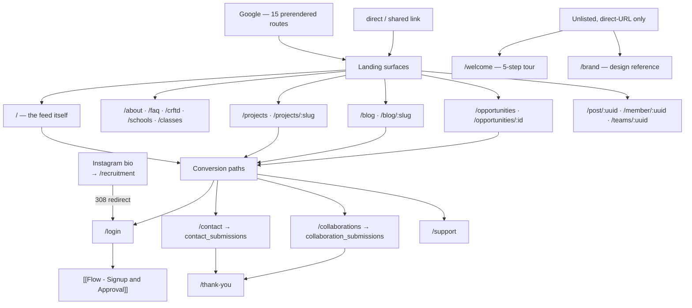

# Flow — Public Visitor Journey

What happens before anyone is a member. 30+ pages under `public/`, and the
conversion paths out of them.

## The journey

## The home page **is** the feed

`/` renders `HomeRoute`, not a marketing splash. `/feed` redirects to `/`. So an
anonymous visitor's first impression is the org's live published content — every
post, mirrored project, mirrored blog and open role, filtered by RLS to
`status='published'`.

That is a strong choice: the marketing page is the work. It also means feed
quality *is* the landing page's quality.

## What an anonymous visitor can read

Everything with a public RLS SELECT: published posts, non-draft welfare projects,
published blogs, all teams and team rosters, non-deleted job openings, all
schools, active member profiles, and the public engagement graph (`likes`,
`follows`, `post_tags`, `post_categories`, `comments` are all `USING (true)`).

They **cannot** see drafts, pending posts, inactive members, any member's
email/phone, notifications, saved posts, or any intake submission.

## Three write paths for anonymous visitors

| Form | Table | Landing |
|---|---|---|
| `/contact` | `contact_submissions` | `/thank-you` |
| `/collaborations` | `collaboration_submissions` | `/thank-you` |
| *(legacy volunteer form)* | `legacy_volunteer_applications` | — |

All are `INSERT … WITH CHECK (true)` for `anon`. **No captcha, no honeypot, no
rate limit.** See [[Intake Tables]].

## The conversion funnel is Google-only

There is no public form to become a member. Every intake URL — `/recruitment`,
`/volunteer/apply` — redirects to `/login`, and a first Google sign-in *is* the
signup.

> [!important] `/recruitment` carries the Instagram traffic
> It is the link in the org's bio. It once 404'd on the reasoning that the form was
> retired, sending every prospective volunteer from social to "LOST IN THE FIELD."
> Check the bio link before ever touching that redirect. See
> [[Flow - Signup and Approval]].

## Marketing page inventory

| Cluster | Pages |
|---|---|
| Story | `/about`, `/crftd` (was `/roots`), `/collaborations` |
| Proof | `/projects`, `/projects/:slug`, `/blog`, `/blog/:slug` |
| Org | `/teams`, `/members`, `/schools`, `/classes` |
| Join | `/opportunities`, `/opportunities/:id`, `/volunteer` (handbook), `/login` |
| Help | `/faq`, `/contact`, `/support`, `/links` |
| Policy | `/privacy-policy`, `/equity-policy` |
| Unlisted | `/welcome`, `/brand` |

`/welcome` is a hidden 5-step onboarding tour with prev/next buttons, arrow keys
and Esc-to-skip — rendered inside `PublicLayout` but absent from nav, footer,
sitemap and `metaConfig`. It is meant to be shared by hand with a prospective
member who wants a guided look first. It is a genuine asset that nothing links
to; see [[Improvement Backlog]].

## Chrome

`PublicLayout` wraps `AQNav` + `AQFooter`, plus `Breadcrumbs`, `MobileMenuBar`,
`ContactNudge`, and `FirstRunController` (first-visit overlay). See
[[Component Library]].

## SEO

15 routes are prerendered, so they return real 200s from the filesystem before
Vercel's rewrite even runs. That is also **exactly what masks a broken SPA
rewrite** — the marketing pages keep working while every client-only route 404s.
See [[Deployment and Vercel]] and [[SEO and Meta]].

Related: [[Flow - Signup and Approval]] · [[Intake Tables]] · [[SEO and Meta]] · [[Routing Map]]
