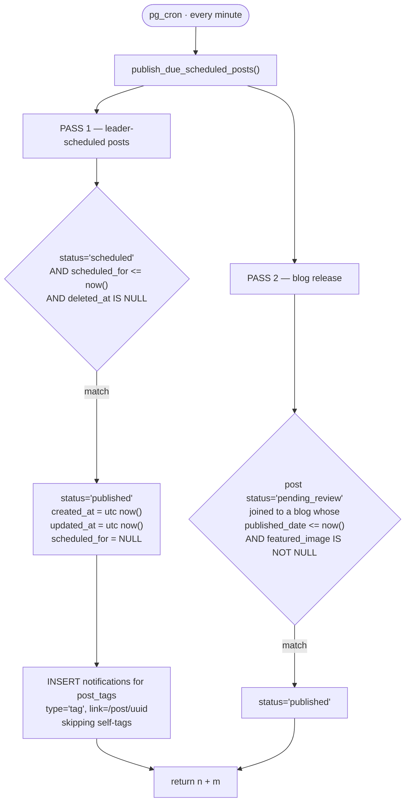

# Flow — Scheduled Publishing

One cron job, running every minute, doing two unrelated jobs.

`cron.job` id 1 · `* * * * *` · active · `select public.publish_due_scheduled_posts();`



## Pass 1 — the leader schedule

Only leaders can schedule (`feedService.createPost` gates `wantsSchedule` on
`isLeader`). Three details matter:

**`created_at` is rewritten to the publish moment.** A post scheduled on Monday
for Friday sorts as *Friday's* post, not Monday's. Correct for a feed — but it
means `created_at` is not the authoring time for scheduled posts, and there is no
column that preserves it.

**`scheduled_for` is nulled** after publishing, so the row becomes
indistinguishable from a normally published post. There is no "was scheduled"
flag.

**Tag notifications are deferred to here.** `createPost` explicitly skips tag
notifications when `scheduledFor` is set:

> The post isn't visible until it publishes, so a "tagged you" link would
> dead-end. The tag rows are still inserted, so the tag shows on the post (and the
> member's tagged tab) once it goes live.

So the cron is the *only* producer of tag notifications for scheduled posts. It
excludes self-tags (`pt.tagged_member_id <> d.author_id`) and truncates the
subtitle to 140 characters, matching the client's behaviour.

> [!note] And this path actually works, unlike the client one
> The cron writes notifications from a `SECURITY DEFINER` context, satisfying the
> `service_role`-only INSERT policy. The browser-side
> `notificationService.create()` does **not**. See [[notifications]].

## Pass 2 — the blog release mechanism

Easy to miss, and it is how blogs reach the feed.

`mirror_blog_to_post()` creates a post the moment a blog draft exists, in
`pending_review`. Pass 2 promotes it once **both** conditions hold: the blog's
`published_date` has arrived, and it has a `featured_image`.

That is why **a blog appears in the feed with no director ever pressing
approve**, and why a coverless blog silently never appears. See [[blogs]].

## Latency

Up to 60 seconds. The UI must not promise "publishes at exactly 6:00 PM" — it
publishes within a minute after. In exchange, a stale `scheduled_for` (an upload
that took too long) becomes a ~1-minute delay rather than a surprise instant
publish.

## Failure characteristics

| Property | Reality |
|---|---|
| Idempotent | ✅ — both passes filter on the pre-state |
| Retries | Not needed; the next minute is the retry |
| Observability | ⛔ **Returns a count nobody reads.** No log table, no alert |
| Failure mode | A broken function means posts silently never publish, and nobody finds out until an author complains |

> [!warning] The one real gap here
> `publish_due_scheduled_posts()` returns `n + m` and the return value is
> discarded. There is no record that the job ran, how many rows it moved, or
> whether it errored. `community_audit_logs` exists and would be the natural home.
> See [[Improvement Backlog]].

## How to verify it live

```sql
-- is the job scheduled and active?
select jobid, schedule, command, active from cron.job;

-- what is waiting?
select uuid, status, scheduled_for from posts
where status = 'scheduled' order by scheduled_for;

-- blogs live but not yet in the feed (the coverless trap)
select b.slug, b.published_date, b.featured_image is null as no_cover, p.status
from blogs b join posts p on p.uuid = b.linked_post_id
where b.published_date <= now() and p.status <> 'published';
```

Related: [[posts]] · [[blogs]] · [[Triggers and Cron]] · [[notifications]]
