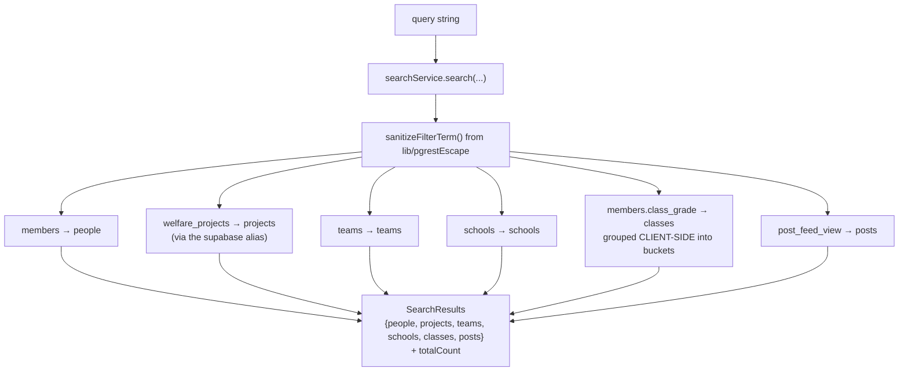

# Flow — Search and Discovery

One search page, six result types, plus several passive discovery surfaces woven
through the feed.

## Search

`/search` (`search/SearchPage.tsx`), reachable from the nav and via a global
**`Cmd/Ctrl+K`** shortcut (suppressed while typing in an input, textarea or
contentEditable). Gated `requireActive` — search is members-only.



`quickSearch` returns a lighter `QuickSearchSuggestion[]` of `person | project |
team` for typeahead.

### `sanitizeFilterTerm` is a security control, not a nicety

`lib/pgrestEscape.ts`. PostgREST filter syntax uses `,` `.` `(` `)` as
**operators**, so raw user input in an `.or()` or `.ilike()` filter can alter the
query's meaning. Every search and directory filter passes through it.

> [!important] Any new user-supplied filter value must go through `sanitizeFilterTerm`
> `directorService.getMemberDirectory` and `getEligibleMembers` already do. This is
> the PostgREST equivalent of parameterising SQL.

### Classes are derived, not stored

`members.class_grade` is **free text** — there is no classes table. Class search
groups matching values client-side and surfaces each as a `SearchClass` with a
member count. `/classes` renders the same derivation.

> [!warning] Free-text classes mean "10-A", "10 A" and "Class 10A" are three classes
> Normalising `class_grade` (or adding a real table) would fix search, `/classes`,
> and the registration form at once. See [[Improvement Backlog]].

### A stale comment to ignore

`searchService.ts` still says welfare projects "live in the legacy welfare
Supabase project (not the community DB)". Since the consolidation that is **false**
— `supabaseWelfare` is an alias of `supabaseCommunity`. The code works; the comment
misleads. See [[Supabase Clients]].

### What search does not cover

`blogs` and `job_openings` are **not** searched. A visitor cannot find a blog post
by title from `/search`, though blog-mirrored posts surface via the `posts`
branch. Also: search reads live every time — no SWR cache — so every keystroke
pays the Tokyo round-trip.

## Passive discovery surfaces

These do the real discovery work, because search requires intent.

| Surface | Component | Fed by |
|---|---|---|
| Trending | — | `feedService.getTrending({limit: 6, days: 7})` |
| Category pulse | `CategoryFilter` | `feedService.getCategoryPulse({days: 7})` |
| Related ticker | `RelatedTicker.tsx` | related content by category |
| Openings strip | `OpeningsStrip.tsx`, `HiringCard.tsx` | open `job_openings` in the feed |
| Recently viewed | `lib/recentlyViewed.ts` | local trail |
| Department links | `lib/categories.ts` `CAT_TO_DEPT` | a category chip becomes "see what this team does" → `/projects#<anchor>` |
| Dynamic island TOC | `DynamicIslandTOC.tsx` | long-page navigation |
| Hi strip / Paradox banner | `HiStrip.tsx`, `ParadoxBanner.tsx` | cross-promotion |

`CAT_TO_DEPT` is the small piece of glue that makes the feed and the marketing
site one graph:

```ts
events → events · welfare → welfare-projects · content → social-media
operations → collabs · labs → shikshaq
```

## Feed browsing itself

`feedService.getFeed({page, limit = 10, category})` over
[[post_feed_view]], chronological, optional category filter. It is **not**
personalised — the follow graph does not affect it, and there is no ranking. For
586 posts and near-zero engagement, chronological is the right call; that changes
if engagement ever arrives. See [[Improvement Backlog]].

Related: [[post_feed_view]] · [[Flow - Engagement and Notifications]] · [[Flow - Public Visitor Journey]]
