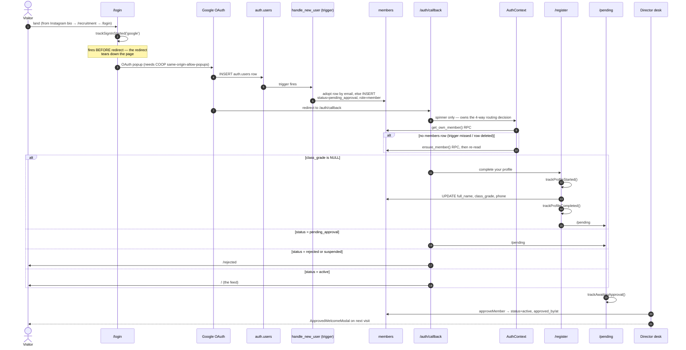

# Flow — Signup and Approval

**There is no `auth.signUp` call anywhere in the codebase**, and that is correct:
a first-time Google sign-in *is* the signup.

## The full path



## Why `/auth/callback` exists as a spinner-only page

It **owns the four-way post-auth routing decision**. Without it, a returning OAuth
user would briefly render the login form before being redirected away — a visible
flash on every sign-in.

## The adopt-then-create pattern

`handle_new_user()` (and the identical `ensure_member()`) first tries:

```sql
UPDATE members SET auth_uid = new.id, google_id, avatar_url, last_login
WHERE auth_uid IS NULL AND lower(email) = lower(new.email)
```

Only if that adopts **zero** rows does it INSERT. So an admin can pre-seed a
member by email and the first Google sign-in claims that existing row — with its
existing role, status and history. That is how 1343 members exist without 1343
signups.

`ensure_member()` is the self-heal path, called from `AuthContext.fetchMember`
when a valid session has no members row. It matters because **`members` has no
INSERT policy** — this `SECURITY DEFINER` RPC is the only client-reachable way to
create a row, and it can only create the caller's own.

## Registration-complete is `class_grade`, not `join_reason`

`ProtectedRoute`:

```ts
if (!member.class_grade) → /register
```

The "what have you built" step was removed, so `join_reason` is no longer
collected and must not be treated as required. The column still exists and
`pending_member_approvals` still exposes it for legacy rows.

## Approval

`director/AccountApprovals.tsx` → `directorService.approveMember(memberId)` flips
the **same auth-linked row** to `active` and stamps `approved_by` / `approved_at`.
It does not create an account, because one already exists.

`rejectMember(memberId, note)` sets `status='rejected'` plus a `rejection_note`
shown on `/rejected`.

This write is only possible because `members_guard_privileged_cols()` permits
`status` changes for `is_director()` — see [[members]]. And the desk tab only
appears for a super admin or a director scoped to `operations` — see
[[Category Scoping]].

## Status → route

| `members.status` | Where they land | Page |
|---|---|---|
| `pending_approval` | `/pending` | `PendingApprovalPage` |
| `active` | `/` | the feed |
| `rejected` | `/rejected` | `RejectedPage` (shows `rejection_note`) |
| `suspended` | `/rejected` | bounced **regardless of `requireActive`** |

## Retired entry points

`public/RecruitmentPage.tsx` **no longer exists**. `/recruitment` and
`/volunteer/apply` both redirect to `/login`.

> [!important] `/recruitment` is the Instagram bio link
> It was once left to fall through to the 404 on the reasoning that "the form is
> retired". Every prospective volunteer arriving from social landed on "LOST IN THE
> FIELD." — the worst possible place to break, since it is the top of the funnel.
> A retired page still needs a redirect for as long as anyone hands the URL out.

## Do not confuse this with `volunteer_applications`

`director/VolunteerApplications.tsx` is a **separate** WhatsApp-outreach lead desk
against the `volunteer_applications` table (495 rows). It has nothing to do with
the login path. See [[Intake Tables]].

## Instrumentation

Four Vercel Analytics events, deliberately few — `signin_started`,
`signup_profile_started`, `signup_profile_completed`, `signup_awaiting_approval`.
The gaps between them are the interpretable numbers:

| Gap | Measures |
|---|---|
| `signin_started` → `profile_started` | OAuth drop-off |
| `profile_started` → `profile_completed` | friction in the `/register` form |
| `profile_completed` → `awaiting_approval` | (should be ~100%) |
| `awaiting_approval` → active | **HR's approval latency** — the one part copy cannot fix |

**No personal data** in events: members are students, many minors.

Related: [[members]] · [[Caching Layers]] · [[Desk - Queues]] · [[Role Model]]
