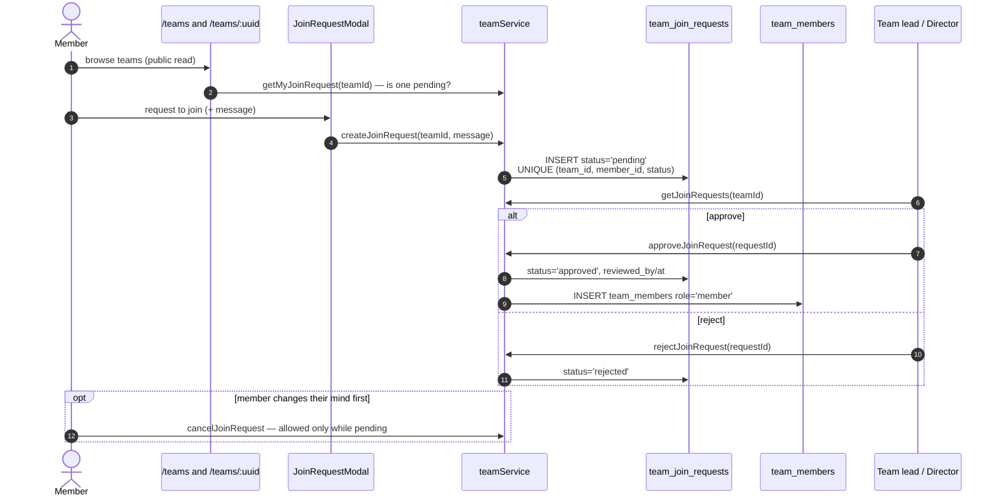
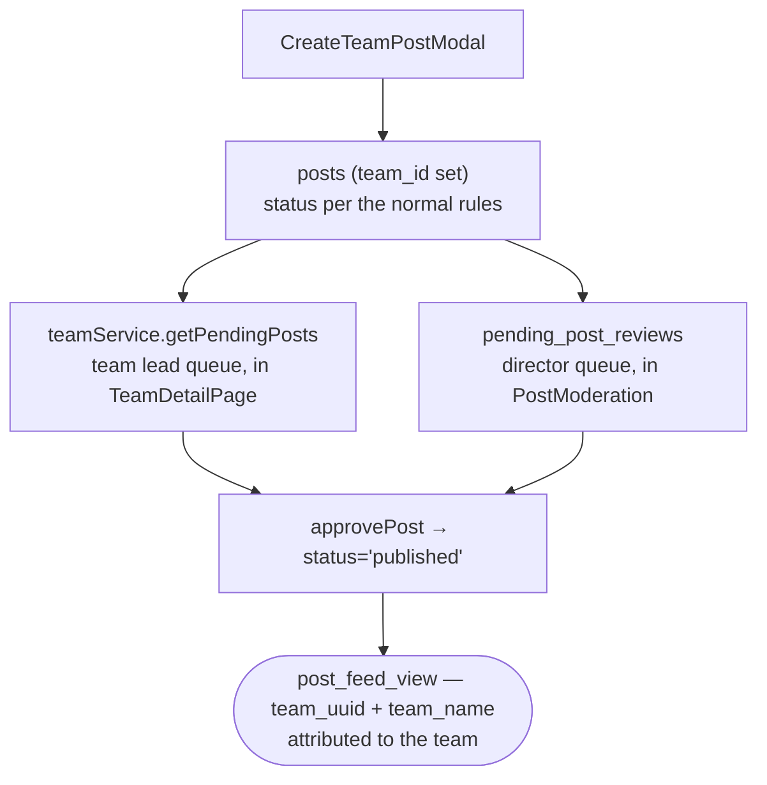

# Flow — Teams and Join Requests

The org-structure loop. Fully built in the database, barely populated in reality
(8 teams, **3 memberships**, 2 join requests).

## Joining a team



`UNIQUE (team_id, member_id, status)` means **one pending request per person per
team**, while still allowing a fresh request after a rejection.

## Who can administer a team

Two different answers, and they do not match.

**RLS says:** a **team lead** — anyone with `team_members.role = 'lead'` for that
team — can update the team, add and remove members, and approve join requests.
Directors can do all of that plus create and delete teams.

**The product says:** team administration lives at `/director/teams`
(`TeamManagement.tsx`) behind `requireDirector`, plus some inline lead actions in
`TeamDetailPage`.

> [!note] The database grants a capability the product barely surfaces
> There is no `/lead` desk. A team lead who is not a director has real powers and
> almost nowhere to exercise them. That is a product opportunity — a team-lead view
> — not a leak. See [[Improvement Backlog]].

And the lead check has a flaw:

```sql
EXISTS (SELECT 1 FROM team_members tm
        WHERE tm.team_id = … AND tm.member_id = get_current_member_id()
          AND tm.role = 'lead')
```

> [!warning] It ignores `is_active` and `left_at`
> A lead who has left the team keeps lead powers until their row is **deleted**.
> Setting `left_at` / `is_active = false` — which is what a "soft remove" would do
> — revokes nothing. Add `AND tm.is_active` to every lead policy. See
> [[Known Gaps and Debt]].

## Team posts — the second moderation queue

A team post is a `posts` row with `team_id` set, created via
`CreateTeamPostModal`. `teamService` has its **own** queue:
`getPendingPosts(teamId)` / `approvePost` / `rejectPost` / `getTeamPosts`.



Both queues write the same `posts.status`, and **nothing coordinates them**. A
pending team post appears in both; either can approve; the second approver simply
re-approves. Benign today, worth knowing. See
[[Flow - Create Post and Moderation]].

## Membership management

| Action | Method | Who (RLS) |
|---|---|---|
| Create team | `createTeam` | director |
| Edit team | `updateTeam` | director ∨ lead of it |
| Delete team | `deleteTeam` | director |
| Add one member | `addMember` | director ∨ lead |
| Add many | `addMembersBulk` | director ∨ lead |
| Change a member's team role | `updateMemberRole` | director ∨ lead |
| Remove a member | `removeMember` | director ∨ lead ∨ **self** (leave) |
| Read a member's contact | `get_team_member_contacts(ids[], teamId)` RPC | the only path — `email`/`phone` are revoked at the column level |

`AddMemberModal.tsx` drives the add flow; `teams` and `team_members` are both
publicly SELECT-able (`USING (true)`), so the roster is open information.

## Notification types that exist for this flow

`team_invite` (**no producer — invites are not implemented**),
`team_join_request`, `team_join_accepted`. And note the client-side notification
insert path appears to be failing entirely — see [[notifications]].

## Live shape

8 teams · 3 memberships · 2 join requests. Everything here is greenfield: the
schema, services and desks are built, and the org has not adopted them. Ask why
before adding capability. See [[Improvement Backlog]].

Related: [[teams]] · [[Role Model]] · [[Desk - People]] · [[Flow - Create Post and Moderation]]
