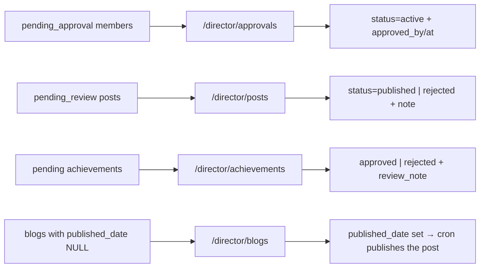

# Desk — Queues

The four things that wait for a human. `/director/approvals` · `/posts` ·
`/achievements` · `/blogs`. All gated `requireDirector`.

---

## `/director/approvals` — AccountApprovals (333 lines)

Reads the `pending_member_approvals` view via
`directorService.getPendingApprovals({page, limit})` — paginated, 10 per page.
The view surfaces `email`, `phone`, `class_grade`, `join_reason` and `bio`,
because an approver needs them to judge.

| Action | Method | Effect |
|---|---|---|
| Approve | `approveMember(memberId)` | `status='active'`, `approved_by`, `approved_at` |
| Reject | `rejectMember(memberId, note)` | `status='rejected'` + `rejection_note`, shown on `/rejected` |

> [!important] This tab is permission-gated twice over
> Visible only when `isSuperAdmin || myCategories.includes('operations')`.
> `AccountApprovals` repeats the gate internally, and the dashboard comment says the
> two **must** mirror each other. Member approval is treated as an operations
> function. See [[Category Scoping]].

The write only succeeds because `members_guard_privileged_cols()` permits `status`
changes for `is_director()`. The same trigger means **no director can change a
role here** — that is `/director/directors`, super-admin only.

See [[Flow - Signup and Approval]].

---

## `/director/posts` — PostModeration (339 lines)

`directorService.getPendingPosts({page, limit, categories})` over
`pending_post_reviews`, then filtered **client-side** to `myCategories`.

| Action | Method | Effect |
|---|---|---|
| Approve | `approvePost(postId)` | `status='published'`, `reviewed_by`, `reviewed_at`, notify author |
| Reject | `rejectPost(postId, note)` | `status='rejected'` + `rejection_note`, notify author |
| *(unused)* | `approvePostCategory(postUuid, category)` | per-category approval via RPC → `post_approvals` |

The badge uses `getScopedPendingPostsCount(cats)` so the number matches the list.

> [!warning] Two caveats
> **Scoping is client-side.** `posts` SELECT/UPDATE is `is_director()` with no
> category clause; a scoped HoD can approve outside their scope via the API.
>
> **The sophisticated path is dead.** `post_approvals` has 0 rows, and its INSERT
> policy calls `is_assigned_to_category()` — which omits the `hod` role, so it would
> fail for HoDs anyway. See [[Views and RPCs]].

Note there is a **second, parallel queue** for team posts inside `teamService`,
surfaced to team leads. Nothing coordinates the two. See
[[Flow - Create Post and Moderation]].

---

## `/director/achievements` — AchievementReviews (291 lines)

`achievementService.getPendingReviews({limit: 50})` — a flat list, **no
pagination** (fine at 3 rows, a gap at 300).

| Action | Method | Effect |
|---|---|---|
| Approve | `approveAchievement(uuid)` | `status='approved'`, `reviewed_by`, `reviewed_at` |
| Reject | `rejectAchievement(uuid, note)` | `status='rejected'` + `review_note` |

The clever part is server-side: if the **owner** later edits the substance of an
approved or rejected claim, `reset_achievement_status_on_owner_edit()` puts it
back in this queue and clears the review metadata. A director's own edits do not.
See [[Flow - Achievements]].

---

## `/director/blogs` — BlogDrafts (237 lines)

`blogService.listDrafts()` — blogs with `published_date IS NULL`.

| Action | Method | Effect |
|---|---|---|
| Set cover | `setDraftCover(id, url)` | fills `featured_image` |
| Publish | `publishDraft(id, …)` | sets `published_date` |
| Delete | `deleteDraft(id)` | |

> [!warning] The cover is a hard publish gate — twice
> Both `mirror_blog_to_post()` and pg_cron pass 2 require `featured_image IS NOT
> NULL` before the mirrored post reaches the feed. A blog published without one is
> **live at `/blog/:slug` and permanently absent from the feed**, with no warning in
> this desk. `setDraftCover` exists as the remedy; making the cover required in the
> composer would be the real fix. See [[blogs]] and [[Flow - Blog Authoring]].

Publishing here does **not** flip the post directly — it sets `published_date` and
lets the cron promote the mirrored post within a minute. See
[[Flow - Scheduled Publishing]].

---

## Queue hygiene the desk gets right

Every queue reads a **purpose-built view or a narrow service method**, not a raw
table. Every action is a single service call with an explicit note field for
rejection. Every rejection is legible to the person rejected — `rejection_note` on
`/rejected`, `review_note` on the achievement, both surfaced to the author.

That last point is the queue's best design property. Preserve it in any new queue.

Related: [[HoD Desk Overview]] · [[Desk - People]] · [[RLS Policy Matrix]]
