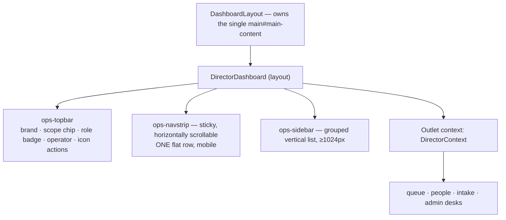

# HoD Desk Overview

`/director/*` — the back office. 14 desks, one layout, one shared component kit.

## `DirectorDashboard` is a layout, not a page

It renders a topbar, a nav, and `<Outlet context={ctx}/>`. **Every desk is a real
route**, so it deep-links and survives a refresh instead of living in tab state.
Routing itself lives in `App.tsx`; `NAV_GROUPS` is purely a data source for
rendering nav.



## `DirectorContext` — what every desk receives

```ts
type DirectorContext = {
  stats: DashboardStats | null
  canApproveMembers: boolean
  isSuperAdmin: boolean
  myCategories: string[]        // empty for super admins — they see everything
  scopedPendingPosts: number | null  // null when unscoped; fall back to stats
}
```

Consume it with `useOutletContext<DirectorContext>()`. Do not re-fetch stats in a
desk — the layout already did.

## `NAV_GROUPS` — the four groups

| Group | Desks |
|---|---|
| **queue** | Approvals · Post Queue · Achievements · Blog Drafts |
| **people** | Members · Teams · Categories |
| **intake** | Hiring · Enquiries |
| **admin** *(all `superOnly`)* | Content · Projects · Manage HoDs · Vol. Applications |

Visibility filter:

```ts
if (item.superOnly && !isSuperAdmin) hide
if (item.key === 'approvals' && !canApproveMembers) hide
```

> [!danger] Two gates, always
> `superOnly` hides the tab. The per-route `requireSuperAdmin` in `App.tsx` blocks
> the URL. **Both are required** — with only the nav flag, a director types
> `/director/projects` and walks in. This has shipped as a real bug. See
> [[Permission Matrix]].

## The scope chip

```
super admin  → "acting as · super admin · all categories"
scoped       → "acting as · HoD · events, welfare"
unscoped     → "acting as · Director"
```

Restated on the landing page too, deliberately: "which desk am I reading?" should
not require looking back up at the nav. See [[Category Scoping]].

## Badge counts, and the rule they follow

```ts
approvals:    stats.pendingMemberApprovals
posts:        scopedPendingPosts ?? stats.pendingPostReviews
achievements: stats.pendingAchievementReviews
```

`getDashboardStats()` fires **five parallel `count: 'exact', head: true`
queries** in one `Promise.all` — five sequential round-trips would be ~600 ms on
the India→Tokyo edge.

> [!important] A badge must match the list behind it
> `getScopedPendingPostsCount(cats)` exists because a scoped director saw the
> *global* pending count on the tab and a smaller list once they opened it.
> `DirectorLanding` extends the same discipline: **only real, non-zero queues make
> the "what needs you today" list**, and it deliberately has no hiring/enquiries
> line because those desks have no count in the stats service — "inventing one would
> be worse than omitting it."

## Mobile-first nav, with two real decisions

**The phone strip is ONE flat row** — no group labels, no icons. Twelve
destinations is a fine number to scan; it was the chrome between them that made it
feel like work. The desktop sidebar keeps its group labels, because a vertical
list of twelve undifferentiated items *is* harder to scan than a horizontal one,
and there is no horizontal budget being spent.

**The strip yields while you read.** Scrolling down past 96 px slides it away
(that is ~52 px of a phone screen better spent on rows); scrolling up brings it
straight back, so switching desks never costs a scroll to the top. Implemented
with a `requestAnimationFrame`-throttled scroll listener and a 6 px jitter
threshold. Desktop is unaffected — the CSS only applies the transform below
1024 px.

A deep-linked desk scrolls its own tab into view once nav renders
(`activeTabRef.scrollIntoView({inline: 'center'})`).

## Code splitting

`DirectorDashboard` lazy-imports each desk **individually**, so opening the desk
downloads only the active tab. Follow the pattern for a new desk:

```ts
const NewTab = lazy(() => import('./NewTab'))
```

…and add the `NavKey` union member, the `NAV_GROUPS` entry, and the `App.tsx`
route with matching gating.

## `adminKit.tsx` — the shared desk kit (576 lines)

Use these instead of hand-rolling. Inline `style` always wins over the cascade,
which is exactly what forced `ProjectManager` and `TeamManagement` to be reworked
before.

| Export | Purpose |
|---|---|
| `AdminLayout`, `AdminTabHeader`, `DataToolbar` | desk chrome |
| `AdminRow`, `AdminRowActions` | list rows |
| `StatusBadge` (`neutral/success/warn/danger/info`), `StatusStamp` (`pending/approved/rejected/custom`) | state display |
| `FilterPill`, `BulkActionBar` | filtering and bulk ops |
| `EmptyState`, `EmptyLedger`, `AdminErrorState`, `AdminSkeleton` (`row/card/grid`) | the four non-happy states |
| `useRowSelection<T>`, `useUndoableAction<T>` | selection and **undo** |
| `useIsPhone`, `BottomSheet` | mobile patterns |
| `useModalA11y`, `MODAL_FOCUSABLE` | re-exported from `hooks/useDialog` |

`useUndoableAction` is the notable one — the desk's destructive actions offer undo
rather than only a confirm dialog.

## Visual language

The desk is **brutalist**, matching `design-reference/AquaTerra - Playground.dc.html`
— not the earlier "flat, calm, boring on purpose" work-tool look. Inside `.admin`,
`.card`/`.hod-card` re-tokens to the prototype `.panel` (white surface, **3px**
ink border, 20px radius, `overflow: visible`). Rows use `.panel-h` / `.qrow` /
`.qname` / `.qsub` / `.qtag` (colored category pill via `--cc`) / `.iconbtn`
(`.ok`/`.no`) / `.role-badge`.

> [!important] Route new containers through `.card`/`.hod-card` and rows through
> `.panel-h`/`.qrow`/`.qtag`/`.iconbtn` rather than inventing a style.

The live desks deliberately keep richer content than the static handoff mockup —
post previews, pagination, role controls, modals — inside the brutalist panel.
See [[Two Design Languages]].

## The desks

- [[Desk - Queues]] — Approvals, Post Queue, Achievements, Blog Drafts
- [[Desk - People]] — Members, Teams, Categories
- [[Desk - Intake]] — Hiring, Enquiries
- [[Desk - Admin Only]] — Content, Projects, Manage HoDs, Vol. Applications

Related: [[Role Model]] · [[Category Scoping]] · [[Permission Matrix]] · [[Service Layer Contract]]
