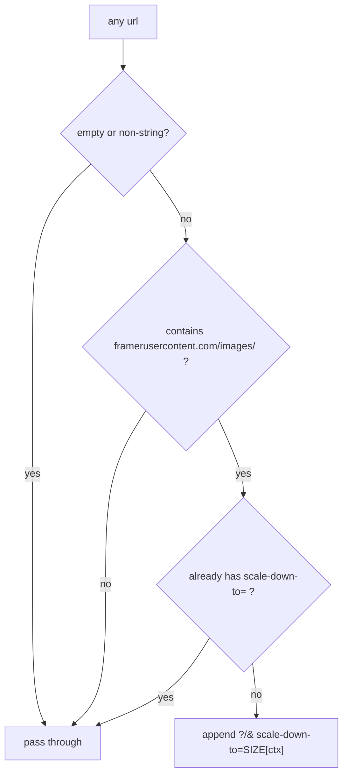

# Image Pipeline

The single biggest real performance bug ever found in this codebase, and its fix.

## The problem

Most content imagery — post images, project covers, blog headers — lives on
**Framer's CDN** (`framerusercontent.com`) at full resolution: **~3.3 MB JPEGs**.
A feed or projects grid renders ~20 of them into cards that are only ~400–640 px
wide. The browser downloads **tens of megabytes to paint thumbnails.**

That was the actual cause of "the data takes forever to load." The entire
`director/*` desk was found and fixed for this once already.

## The fix — `sized(url, ctx)` in `lib/imageUrl.ts`

Framer's CDN supports on-the-fly downscaling via `?scale-down-to=N` (caps the
**longer edge**) and negotiates WebP from the browser's `Accept` header
automatically. A 3.3 MB original becomes **~225 KB at 1024 px in WebP — a 15×
cut** with no visible quality loss at the sizes actually rendered.

It only ever downscales, never upscales. And it is free: it is Framer's CDN, so
the Supabase plan tier is irrelevant.

```ts
export type ImgContext = 'avatar' | 'thumb' | 'card' | 'cover' | 'full'

const SIZE = {
  avatar: 192,   // 40–96 px avatars
  thumb:  320,   // small inline thumbnails
  card:  1280,   // feed / project / blog cards (display ~400–640 px)
  cover: 1600,   // list cover / hero strips
  full:  2000,   // lightbox / full detail
}
```

Targets are ~**2× the CSS display size** so they stay crisp on retina — quality is
preserved, only wasted resolution is trimmed.

## Why it is safe to wrap around anything



It rewrites **only** `framerusercontent.com` image URLs. Supabase Storage, Google
avatars and Drive, `data:` / `blob:` URIs, relative paths and already-sized URLs
pass through untouched. So `sized()` is safe to call without knowing the host.

## The rule

> [!danger] Never add a new `` without wrapping it
> ```tsx
> 
> ```
> Or use the `Img` component. Picking the right `ctx` matters: an `avatar` at
> `'full'` ships a 2000 px image into a 40 px circle and undoes the whole point.

`lib/imageUrl.ts` is one of only three unit-tested files
(`imageUrl.test.ts`) — the pass-through behaviour is the thing worth protecting.

## The gap: your own uploads are not optimised

`sized()` deliberately ignores Supabase Storage URLs. But `post-images`,
`avatars` and `project-images` are the buckets **members and directors upload
to**, with no size cap and no MIME allow-list ([[Storage Buckets]]).

> [!warning] A 4 MB phone photo uploaded to `post-images` is served at 4 MB into a 400 px card
> The historical bug was Framer-hosted imagery and `sized()` fixed that; the same
> bug now exists in miniature for self-hosted uploads, and it grows every time
> someone posts.
>
> Two contained fixes, either or both:
> 1. Extend `sized()` to rewrite Supabase URLs using Supabase's own image
>    transformation (`?width=`) — same function, same call sites, no component
>    changes.
> 2. Downscale client-side before upload in `CreatePostModal` / `uploadAvatar`.
>
> Plus set bucket size caps and MIME allow-lists. See [[Improvement Backlog]].

## Related pieces

- `components/Img.tsx` — the wrapper component
- `components/ImageLightbox.tsx` + `styles/lightbox.css` — full-size viewing,
  the one place `'full'` belongs
- `hooks/useMeta.ts` imports `sized` too, so OG images are right-sized for
  crawlers
- `post_feed_view`'s image fallback ladder decides *which* URL you get in the
  first place — see [[post_feed_view]]

Related: [[Storage Buckets]] · [[Caching Layers]] · [[Component Library]]
