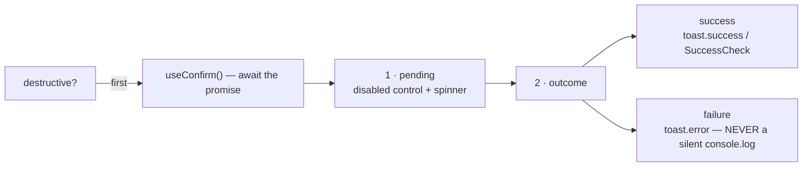

# Motion and Feedback

Two conventions, both stated by the codebase as **strict, not suggestions**.

## The feedback contract

Every mutation, everywhere, must do three things:

Primitives: `useToast()` from `components/Toast.tsx`
(`toast.success` / `error` / `info`) and `useConfirm()` from
`components/Confirm.tsx` (promise-based).

> [!danger] A change that adds a mutation without wiring both is incomplete
> This is the codebase's own standard. And it pairs with the
> [[Service Layer Contract]]: services **throw**, they never toast. So a missing
> `catch` in a component means a **completely silent failure** — the service threw,
> nothing caught it, the user sees nothing.

The one sanctioned exception is `notificationService.create()`, which is
non-throwing by design. Note that this exception is also currently hiding a real
bug — see [[notifications]].

## The motion toolkit — `lib/motion.ts`

Shared framer-motion config. Reuse instead of re-deriving per file.

| Export | Value / purpose |
|---|---|
| `tapScale` | `{ scale: 0.96 }` — **always 0.96, never lower** |
| `springPop` | `{ type: 'spring', duration: 0.4, bounce: 0.28 }` |
| `springSoft` | `{ type: 'spring', duration: 0.5, bounce: 0.1 }` |
| `fadeInUp` | entrance |
| `staggerContainer` | list entrance |
| `popIn` | modal / badge entrance |
| `likeBurst` | `scale: [1, 1.2, 0.97, 1]`, 0.28 s, `times: [0, 0.4, 0.7, 1]` |

> [!important] One press scale, everywhere
> `tapScale` is `0.96` and that is deliberate — a deeper press reads as a different
> component. Two springs cover every transition: `springPop` for things that should
> feel eager, `springSoft` for things that should feel calm.

`likeBurst` overshoots to 1.2, dips to 0.97, settles at 1 — the classic
overshoot-and-settle that makes a heart tap feel physical. Its `times` array
front-loads the growth (40% of the duration) and lets the settle take the rest.

## Motion components

`Reveal` (scroll reveal via `whileInView`) · `CountUp` / `StatCountUp` (rolling
numbers) · `SuccessCheck` (self-drawing checkmark for submit-success states) ·
`ConfettiBurst` · `SparklesText` · `AnimatedGradientBackground` ·
`ProgressiveFluxLoader`.

## Reduced motion is mandatory

Everything in the toolkit must honour `prefers-reduced-motion`, via framer-motion's
`useReducedMotion()`, matching the existing global
`@media (prefers-reduced-motion: reduce)` rules in the CSS.

> [!warning] This is an accessibility requirement, not a nicety
> A `useReducedMotion()`-less animation ships an accessibility regression that no
> test will catch.

## The desk stays motion-light

By the same classification as [[Two Design Languages]]: `lib/motion.ts` and the
reveal/count-up components are **front-end tools**. The HoD desk is deliberately
motion-light — a work tool should not animate while someone works a queue. The
desk's own kit provides `AdminSkeleton` and `useUndoableAction` instead of
transitions.

`paradox/lib/motion.ts` is a **separate** toolkit for the event sub-app, which uses
framer-motion heavily. Do not cross-import.

## Optimistic UI

Used for like and save — the count moves before the round-trip settles. Correct
for a Tokyo-region database, where the honest wait is ~150 ms+.
`feedService.toggleLike(uuid, knownPostId, knownLikeCount)` accepts the known
values precisely so the caller can skip a lookup and settle faster.

## The four states every list must handle

`adminKit` names them, and the public side should match: **loading**
(`AdminSkeleton` / `Skeleton`), **empty** (`EmptyState` / `EmptyLedger`, with copy
from `lib/emptyJokes.ts`), **error** (`AdminErrorState` / `ErrorState`, with a
retry), and **content**. A list that only handles loading and content is
unfinished.

Related: [[Component Library]] · [[Service Layer Contract]] · [[Two Design Languages]]
