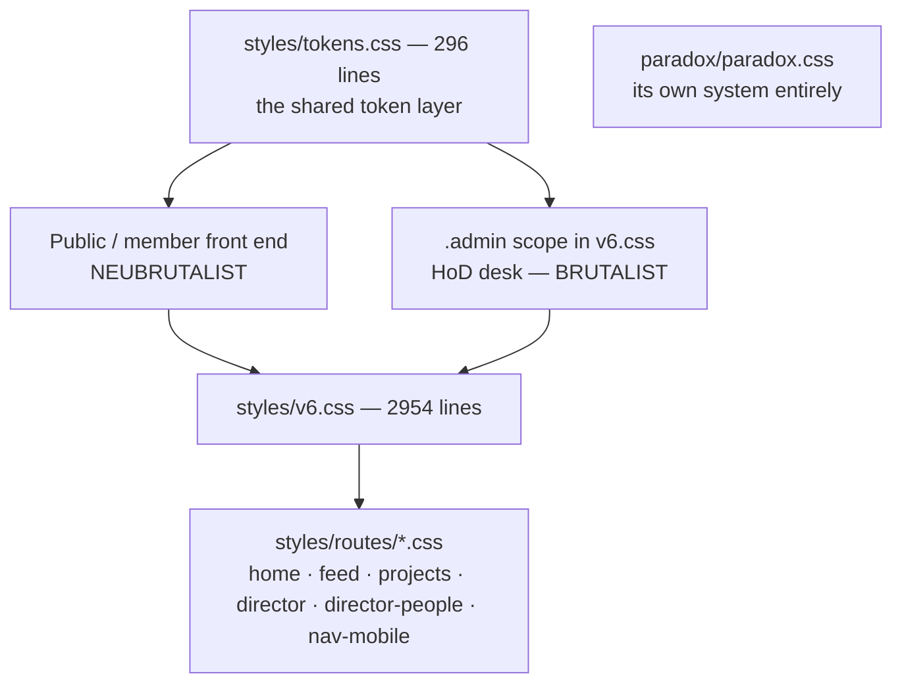

# Two Design Languages (Three, Counting Paradox)

Intentional divergence. Don't "unify" them.

## 1. Public and member surfaces — neubrutalist

`public/*`, `feed/*`, `profile/*`, `teams/TeamsPage.tsx`, most of
`teams/TeamDetailPage.tsx`.

Hard **2px** ink borders · hard offset box-shadows (`Npx Npx 0 0 var(--ink)`) ·
rotated "sticker" badges · bold display type.

This is deliberate: **front-end UI is allowed to trade a little polish for brand
personality.**

## 2. The HoD desk — brutalist, and recently reversed

`director/*`, scoped through `.admin` in `v6.css`.

> [!important] The desk's visual target was reversed in the 2026-07 handoff pass
> It now matches the handoff's **brutalist** HoD desk
> (`design-reference/AquaTerra - Playground.dc.html`) — **not** the earlier "flat,
> calm, boring on purpose" work-tool look. Notes describing the desk as intentionally
> plain are stale.

Inside `.admin`:
- `.card` / `.hod-card` re-token to the prototype `.panel` — white surface,
  **3px** ink border, 20px radius, `overflow: visible`
- rows use `.panel-h` / `.qrow` / `.qname` / `.qsub` / `.qtag` (colored category
  pill via the `--cc` custom property) / `.iconbtn` (`.ok` / `.no`) /
  `.role-badge`
- `DirectorDashboard`'s landing has a dark "command desk." header and solid
  colored stat cards

The old `--hod-surface` / `--hod-border` / `--hod-shadow` / `--hod-radius` tokens
still exist for dark-theme fallbacks and a few calmer surfaces, but **light mode
is brutalist by default**.

> [!danger] Route new desk surfaces through the existing classes
> Containers via `.card` / `.hod-card`; rows via `.panel-h` / `.qrow` / `.qtag` /
> `.iconbtn`. **Inline `style` always wins over the cascade** — which is exactly what
> forced `ProjectManager.tsx` and `TeamManagement.tsx` to be reworked. Adding a
> hand-rolled style is how the desk drifts.

The live desks intentionally carry **richer content than the mockup** — post
previews, pagination, role controls, modals — inside the brutalist panel. The
handoff is a simplified static prototype with fake rows; do not strip real
functionality to match it.

## 3. Paradox — its own world

`paradox/*` brings its own `paradox.css`, heavy `framer-motion` use, and its own
Nav, Footer, AuthProvider and ToastProvider. **Do not try to unify it with either
of the above.** See [[Paradox Sub-App]].

## The CSS layer stack

| File | Lines | Role |
|---|---|---|
| `styles/tokens.css` | 296 | the shared token vocabulary — colours, type, spacing, category colours (`--events`, `--lemon`, `--sky`, `--teal`, `--accent`, `--ink`, `--line-2`) |
| `styles/v6.css` | 2954 | the main system, including the whole `.admin` layer and global keyframes (`spin` lives here, which is why inline spinners need no `<style>`) |
| `styles/routes/*.css` | — | per-route: `home`, `feed`, `projects`, `director`, `director-people`, `nav-mobile` |
| `styles/footer.css`, `lightbox.css` | — | component-scoped |
| per-component `.css` | — | ~20 files alongside their `.tsx` |

Category colours are referenced from TS as `var(--events)` etc. (see
`DirectorLanding`'s stat tiles and `--cc` on `.qtag`), so the token file is the
single source for category identity across both languages.

## Dark mode and reduced motion

Both are real. `--hod-*` tokens exist as dark-theme fallbacks, and there are
global `@media (prefers-reduced-motion: reduce)` rules that everything in
[[Motion and Feedback]] must honour.

## Where to look before styling anything

`/brand` (unlisted route, `public/BrandPage.tsx`) is the live design-system
reference sheet. `/dev/components` (`dev/ComponentGallery.tsx`, DEV-only) is the
component showcase. Use them instead of reverse-engineering from a page.

Related: [[Component Library]] · [[Motion and Feedback]] · [[HoD Desk Overview]]
