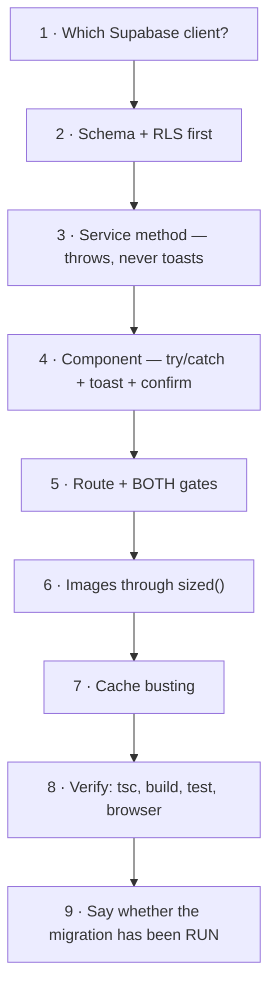

# How to Add a Feature

A checklist derived from the conventions this codebase actually enforces, and from
the bugs it has already shipped once.

## The full path



---

## 1 · Pick the client

Check what the **surrounding file** already imports. Mixing them fails silently.

| Context | Import |
|---|---|
| `services/*`, most of `director/*`, `auth/*` | `supabaseCommunity` |
| welfare projects / blogs consumers | `supabase` (same DB, `any`-typed) |
| anything under `paradox/` | the paradox client |

→ [[Supabase Clients]]

## 2 · Schema and RLS, before any TypeScript

- Write an ad-hoc `.sql` in `frontend/scripts/` with a comment block saying what
  it does and **why**. There is no migration runner.
- A new table arrives with **RLS on and no policies** (`rls_auto_enable` event
  trigger) — it returns zero rows until you write them. That is correct.
- Compose policies from `is_director()` / `is_super_admin()` /
  `get_current_member_id()`. **Never hand-roll the role array** — three existing
  policies did and have drifted.
- Ownership means `= get_current_member_id()`. `auth.role() = 'authenticated'` is
  **not** ownership (that mistake is live in `job_applications`).
- PII needs a **column** grant revocation as well; a policy protects rows, not
  columns.
- Follow `external_achievements` for review lifecycles: force the submit state in
  the INSERT `CHECK`, and reset on substantive owner edit via a trigger.

→ [[RLS Policy Matrix]] · [[Views and RPCs]]

## 3 · Service method

- Lives in `services/*.ts`. It **throws** on error. It **never** calls `toast`.
- Return `{ success: true, data }` on the happy path (convention), but remember
  `success` is not an error channel.
- Start mutations with `getCachedMemberId()` rather than re-querying `members`.
- Reads for display go through **`post_feed_view`** and the shared
  `POST_FEED_COLS` / `POST_DETAIL_COLS` constants — never hand-roll a select list,
  and never query `posts` directly for display (you will show soft-deleted rows).
- Any user-supplied filter value must pass through `sanitizeFilterTerm()`.

→ [[Service Layer Contract]]

## 4 · Component

Every mutation, without exception:

```tsx
const toast = useToast(); const confirm = useConfirm()
const [busy, setBusy] = useState(false)

async function onSave() {
  if (destructive && !(await confirm({...}))) return
  setBusy(true)
  try {
    await someService.doThing(...)
    toast.success('Saved')
  } catch (e) {
    toast.error(getMessage(e))     // never a silent console.log
  } finally {
    setBusy(false)
  }
}
```

- Handle **all four** list states: loading, empty, error-with-retry, content.
- Use `tapScale` (always `0.96`), `fadeInUp`, `popIn` from `lib/motion.ts`.
- Honour `prefers-reduced-motion` via `useReducedMotion()`.
- Public surfaces are neubrutalist; desk surfaces route through
  `.card`/`.hod-card` and `.panel-h`/`.qrow`/`.qtag`/`.iconbtn`. **No inline
  `style`** in the desk — it wins over the cascade and has forced rewrites twice.

→ [[Motion and Feedback]] · [[Two Design Languages]] · [[Component Library]]

## 5 · Route and gating

- Add the `lazy()` import in `App.tsx` (use `lazyWithRetry`).
- For a new desk: add the `NavKey` union member, the `NAV_GROUPS` entry, the
  `lazy()` import in `DirectorDashboard`, **and** the `App.tsx` route.

> [!danger] For a super-admin surface you need BOTH
> `superOnly: true` in `NAV_GROUPS` **and** `<ProtectedRoute requireSuperAdmin>` on
> the route. The nav flag only hides the tab — a director types the URL and walks in.
> This has shipped as a real bug.

- Consume `useOutletContext<DirectorContext>()`; do not re-fetch stats.
- If you add a badge count, make it **match the list behind it** (see
  `getScopedPendingPostsCount`).

→ [[Routing Map]] · [[Permission Matrix]] · [[HoD Desk Overview]]

## 6 · Images

Every `` on a remote URL: `sized(url, ctx)` with `ctx` ∈ `avatar | thumb |
card | cover | full`, or the `Img` component. Picking `'full'` for an avatar
undoes the entire optimisation. → [[Image Pipeline]]

## 7 · Caches

- Writing `welfare_projects`? Call `bustProjectsCache()`. Nothing enforces it, and
  the failure looks like "my publish didn't work".
- Adding a read-heavy public list? Use `swrCache` (sessionStorage).
- Never bypass `AuthContext`'s member cache rules — in particular, never null the
  member on a transient error.

→ [[Caching Layers]]

## 8 · Verify

```bash
cd frontend && npm run build
```

1. `tsc -b` must pass (part of `build`)
2. `npm run build` must succeed
3. `npm test` if you touched `roles.ts`, `imageUrl.ts` or `profanityFilter.ts`
4. Browser-verify anything with runtime behaviour

> [!warning] The build is a weaker gate than it looks
> Welfare-project and blog queries are typed `any` and are **invisible to `tsc`**.
> Browser-verify those by hand.

If you touched routing:

```bash
for u in / /login /director /post/abc; do curl -s -o /dev/null -w "%{http_code} $u\n" https://www.ngoaquaterra.com$u; done
```

All four must be 200. → [[Deployment and Vercel]]

## 9 · Say whether the migration has been run

> [!danger] A `.sql` file in the repo does not mean it has been applied
> `job_applications` was referenced throughout `lib/jobOpenings.ts` for a long time
> before anyone noticed the table did not exist live. **Every** schema-dependent
> change must state explicitly, in the PR or handoff note, whether the migration
> still needs running.

---

## Things not to do

| Don't | Because |
|---|---|
| Wire a feature to a backend API | There isn't one. `services/api.ts` is types only |
| `select('*')` on `members` | Four columns are revoked; use `get_own_member()` or an explicit list |
| `role === 'hod' \|\| role === 'director'` | Use `hasLeaderAccess()` / `is_director()` |
| Query `posts` for display | Use `post_feed_view` — it is the only thing filtering `deleted_at` |
| Add a toast inside a service | The component owns feedback |
| Trust the older root-level `*.md` docs | Verify against `frontend/src` and the live schema |
| Unify Paradox with anything | Separate project, auth, design system, motion toolkit |
| Add an inline `style` in the desk | It beats the cascade and breaks the design system |

Related: [[00 START HERE]] · [[Improvement Backlog]] · [[Known Gaps and Debt]]
