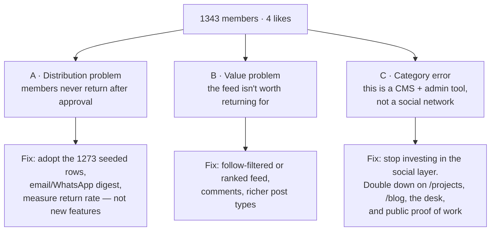

# Improvement Backlog

The same findings as [[Known Gaps and Debt]], sequenced by **value per unit of
effort**. Sizes are honest: S = under an hour, M = a day, L = multi-day, XL = a
project.

---

## Tier 0 — do these first (hours, no code, or one line)

| # | Change | Size | Why now |
|---|---|---|---|
| **0** | **`REVOKE SELECT (email, phone, auth_uid, google_id) ON members FROM authenticated`** | **S** | **Any signed-in account can currently read 1314 student emails + 37 phone numbers. The migration meant to prevent this was never applied. Do this first (S0)** |
| 1 | `job_applications` INSERT → `applicant_id = get_current_member_id()` | **S** | Closes the only impersonation hole in the schema (S1) |
| 2 | Set size caps + MIME allow-lists on the four content buckets | **S** | Dashboard-only, no deploy. Copy the photobooth config (S3) |
| 3 | Add `AND tm.is_active` to every team-lead RLS check | **S** | Soft-removal currently revokes nothing (C7) |
| 4 | Add `hod` to `is_assigned_to_category()` | **S** | Restores the stated hod ≡ director rule (C2) |
| 5 | Drop one `approve_post_category` overload | **S** | Removes a resolution ambiguity (C8) |
| 6 | Revoke `anon` INSERT on `legacy_volunteer_applications` | **S** | Retired form, open write endpoint (S2) |
| 7 | Fix the three stale comments + `CLAUDE.md`'s "three projects" | **S** | They actively mislead the next reader (T5) |
| 8a | Assign the org's single HoD their `director_categories` rows | **S** | They currently cannot see the Approvals tab at all (C1c) |
| 8b | Add an SQL comment to both `security_invoker=false` views warning that their in-body director check is the only gate | **S** | Removing it in a refactor turns them into PII dumps (SIM-2) |
| 8c | Add `main_image IS NOT NULL` to the welfare mirror publish gate | **S** | 57 live projects render as empty grey cards — the exact failure the blog gate prevents (C1d) |
| 8d | Allow authors to edit `rejected` posts + reset to `pending_review` on edit | **S–M** | Rejection is currently terminal; 0 live rejected posts means zero migration risk (C1e) |

Tier 0 is roughly **one focused afternoon** and removes the schema's real security
exposure. Item 0 alone is a one-line `REVOKE`.

---

## Tier 1 — high value, contained (a day each)

| # | Change | Size | Notes |
|---|---|---|---|
| ~~8~~ | ~~Fix the notification insert path~~ | — | **Withdrawn — it already works via the `create_notification` RPC.** Replaced by: dedup like-notifications so unlike/relike stops flooding the author (C1b) |
| 8e | **Stop using `status='active'` as an engagement denominator** | **M** | 1273 of 1314 "active" members have never signed in. Every per-member metric is overstated ~32×. Add `auth_uid IS NOT NULL` to `getDashboardStats` (SIM-12) |
| 9 | Add `deleted_at` on un-publish for welfare projects | **M** | A trigger branch; closes the clearest content-lifecycle gap (C3) |
| 10 | Make the blog cover **required** in the composer | **M** | Turns a silent invisible-blog failure into a form validation (C4) |
| 11 | Add hiring + enquiries counts to `getDashboardStats` | **M** | Two desks currently have no unread signal at all (O2) |
| 12 | Log cron runs to `community_audit_logs` | **M** | The scheduler is currently unobservable (O1) |
| 13 | Extend `sized()` to Supabase Storage URLs | **M** | Same function, same call sites. Your own uploads are the remaining unoptimised images (Image Pipeline gap) |
| 14 | Decide: ship comments, or hide `comment_count` | **M** or **L** | A permanent `0` on every card is worse than either (U1) |
| 15 | Mark `/director/categories` `superOnly`, or make it read-only | **S–M** | Its every action fails for plain directors (C10) |
| 16 | Rate-limit the public intake forms | **M** | Turnstile or an Edge Function (S2) |
| 17 | Instrument the intake forms | **S–M** | Extend `lib/funnel.ts`; no personal data (O8) |

---

## Tier 2 — decisions before code

These need a call from the org, not just an implementation.

### 18 · Is category scoping a boundary or a convention? (S4)
Today it is a client-side convention. If it should be real, add a category clause
to `posts` UPDATE for non-super-admins — and accept that a scoped HoD then
genuinely cannot help with another desk's backlog. **Cheap either way, but pick
one and write it down.** → [[Category Scoping]]

### 19 · Who owns welfare projects? (S5)
RLS says any director; the desk says super admin only. Tighten the policy or open
the desk. → [[welfare_projects]]

### 20 · Should there be a team-lead desk? (U6)
RLS already grants leads real powers with nowhere to use them. A `/lead` surface
is a genuine feature, not a fix. But 8 teams with **3 memberships** says adoption,
not capability, is the constraint. → [[teams]]

### 21 · Type the CMS client (T1)
Replacing `export const supabase = supabaseCommunity as any` with a properly typed
client means fixing every latent type error in ~6 files — but it restores
`npm run build` as a real gate for 558 rows of the org's primary content.
**L**, and worth it. → [[Supabase Clients]]

---

## Tier 3 — the product question that dwarfs the rest

**Reframed 2026-08-10 by measurement.** The original framing — "1343 members, 4
likes" — was built on two wrong numbers. What the database actually says:

| Measured | Value |
|---|---|
| Members who have **ever signed in** | **41** (1273 of 1314 "active" rows have `auth_uid IS NULL`) |
| **Human-authored posts, ever** | **0** — all 586 are welfare-project or blog mirrors |
| Open job openings | **0** (4 closed, 1 paused) |
| Team leads | **0** |
| Directors | **0** (15 super admins, 1 HoD) |

So it is not a social network with low engagement. **It is a CMS publishing
pipeline with a feed as its presentation layer, and it has never been used as
anything else.** 4 likes from 41 real users is unremarkable; the denominator was
the anomaly.

Everything built for authoring — `CreatePostModal`, the profanity filter,
`forceReview`, the moderation queue, scheduling, tagging, stat blocks, team posts,
`post_images`, share-as-post — has **zero live usage**. Moderation has run 23 times
total.

Meanwhile `volunteer_applications` has 495 rows with `texted` / `texted_by` /
`added` columns, because **the real funnel runs through WhatsApp**, outside the
product.

Three honest readings, and they lead to different roadmaps:

> [!important] Do not build Tier 1 item 14 (comments) before answering this
> Shipping comments into a feed with **zero human-authored posts and 41 real users**
> adds a moderation surface to a product nobody is authoring in. The cheap
> measurement — of the 41, how many return in a month — is a Tier 1-sized piece of
> work and comes first.

Reading **C** is now the one the data strongly supports. **558 welfare projects and
36 blogs against 0 human posts** is not a struggling social network; it is a
well-run publishing operation whose social features were speculative. Retiring or
freezing the social layer would be a legitimate and clarifying decision — and it
would immediately shrink the security surface in [[Known Gaps and Debt]] (posts
RLS, tags, likes, saves, follows, notifications, the two moderation queues) to
almost nothing.

The counter-argument worth taking seriously: the authoring path may be unused
because **1273 members were never onboarded**, not because nobody wants it. That is
reading **A**, and adopting those seeded rows is testable far more cheaply than
building anything.

---

## Tier 4 — large, deferred by design

| # | Change | Size | Note |
|---|---|---|---|
| 22 | `welfare_projects.image_1..4` → a `project_images` child table | **XL** | 558-row migration + rewrite of 5 consumers. Correct shape; not urgent |
| 23 | Normalise `members.class_grade` (or add a classes table) | **L** | Fixes search buckets, `/classes`, and the register form at once (Search) |
| 24 | Timestamp type unification | **L** | Real drift, low current pain (T2) |
| 25 | An **RLS policy test suite** | **L** | The highest-leverage test to add, since RLS *is* the authorisation layer (O7) |
| 26 | Storage orphan cleanup | **M** | Check the `protect_delete` triggers' intent first (O6) |
| 27 | Materialise or denormalise `like_count`/`comment_count` | **M** | Only if engagement arrives (O3) |
| 28 | Paradox debt + the photobooth consumer | **XL** | Deferred by design ([[Paradox Sub-App]]) |

---

## Free wins nobody has taken

- **Link `/welcome` from somewhere.** A finished 5-step onboarding tour that
  nothing points to. Add it to `/login` as "new here? take the tour" and it starts
  earning (U7).
- **Remove or finish the arcade.** Two tables, 30 seeded questions, two broken
  policies, and a route that redirects home. Either is better than the current
  state (U4).
- **`schools` has 0 rows** with a full table, service, RLS, `members.school_id` and
  a public page. Populating it is data entry, and it would immediately make
  `/schools` and school-scoped search real (U3).

---

## How to use this list

1. Tier 0 in one sitting. Nothing there needs a decision.
2. Tier 1 items 8, 11, 12 next — they restore **visibility** into whether the
   system is working at all.
3. Answer Tier 3 before spending a week on any engagement feature.
4. Add [[Known Gaps and Debt]]'s findings to this list as they are fixed, and
   date-stamp the removal.

Related: [[Known Gaps and Debt]] · [[How to Add a Feature]] · [[00 START HERE]]
