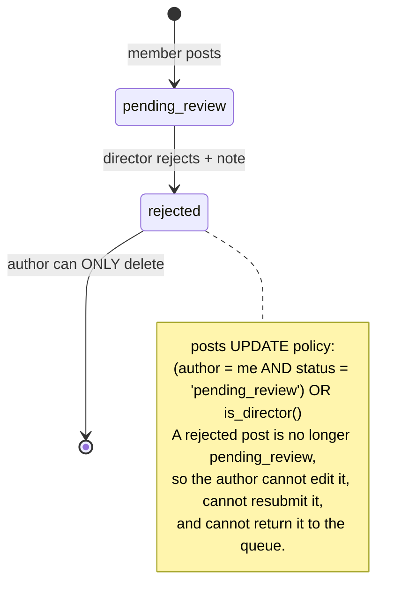

# Simulation Log — 2026-08-10

Scenarios walked through the real system rather than reasoned about. Where a
claim could be tested empirically, it was — including claims made elsewhere in
this vault. **Two vault claims were falsified. One new critical finding emerged.**

Every number below came from a live query. Nothing here is inferred where it
could be measured.

---

## 🔴 SIM-1 · "Can a signed-in member read everyone's email and phone?"

**Expected (per [[members]] and `scripts/members_pii_lockdown_2026_07_29.sql`):**
no — `email`, `phone`, `auth_uid`, `google_id` are revoked at the column level for
`authenticated`, so a plain `select('*')` fails.

**Test:**
```sql
begin; set local role authenticated;
select count(*), count(email), count(phone) from members;
```

**Result:**

| probe | result |
|---|---|
| rows visible | **1314** |
| **emails readable** | **1314** |
| **phones readable** | **37** |

> [!danger] The PII lockdown migration is NOT applied to the live database
> `information_schema.column_privileges` confirms `authenticated` still holds
> `SELECT` on **`email`, `phone`, `auth_uid`, `google_id`**. The members SELECT
> policy permits reading every `status='active'` row, so **any signed-in
> account — including an unapproved `pending_approval` one — can dump 1314 student
> emails and 37 phone numbers in a single query.**
>
> `anon` *is* correctly locked down (SELECT only on `full_name` and `bio`). So the
> migration was applied partially, or applied and later undone by a role/grant
> reset.
>
> This is a textbook instance of the vault's own warning: **a `.sql` file in the
> repo does not mean it has been applied.** `AuthContext.fetchMember`'s comment
> asserts "a plain `select('*')` would now fail outright for those columns" — that
> premise is false against the live database. The code is defensively correct; the
> database is not.
>
> **Fix:**
> ```sql
> REVOKE SELECT (email, phone, auth_uid, google_id) ON public.members FROM authenticated;
> ```
> Then re-run this simulation. `get_own_member()` already exists so the app keeps
> working. Subjects are students, many of them minors — treat as urgent.

---

## ✅ SIM-2 · "Do the two `security_invoker=false` views leak PII?"

`pending_member_approvals` and `member_directory_view` are `security_invoker=false`
and granted `SELECT` to `authenticated` — which normally means they execute with
the **owner's** privileges and bypass RLS on `members`.

**Test:** same anonymous-`authenticated` context, select from both.

**Result: 0 rows from each.** Reading the definitions explains why — the gate is
**inside the view body**:

```sql
-- pending_member_approvals
WHERE status = 'pending_approval' AND is_active = true AND (is_director() OR is_super_admin())
-- member_directory_view
WHERE is_director() OR is_super_admin()
```

**Verdict: safe, but for a fragile reason.** These views do not rely on RLS at
all; they carry their own predicate. That is a legitimate pattern — and it means
**anyone editing either view must preserve that `WHERE` clause.** Dropping it
turns both into unauthenticated PII dumps instantly, with no policy anywhere to
catch it.

Add a comment on both views saying exactly that. `pending_post_reviews`
(`security_invoker=true`) and `post_feed_view` (`security_invoker=on`) correctly
delegate to RLS instead.

---

## ❌ SIM-3 · "Are client-written notifications silently failing?" — VAULT WAS WRONG

**Vault claimed (finding C1):** `notifications` INSERT requires
`service_role`; `notificationService.create()` runs as `authenticated`; therefore
tag/like/follow/approval notifications fail silently.

**Test:** count notifications by type. If the claim held, only cron-written `tag`
rows should exist.

**Result:**

| type | rows |
|---|---|
| `post_approved` | **23** |
| `system` | 20 |
| `like` | **8** |
| `follow` | **1** |
| `tag` | 1 |

Client-originated types are present in quantity. So I read the function body I
had previously only skimmed:

```ts
const { error } = await (supabaseCommunity as any)
  .rpc('create_notification', { p_member_id, p_type, p_title, ... })
```

> [!check] Corrected — this is well-designed, not broken
> `notificationService.create()` calls the **`create_notification` SECURITY DEFINER
> RPC**, never a direct INSERT. The `service_role`-only INSERT policy is therefore
> *deliberate*: direct INSERT is revoked and the RPC is the sole path.
>
> Better still, the RPC (per `security_hardening_2026_07.sql` M4) splits the types
> by authority: **social** types (`like`/`comment`/`follow`/`tag`/
> `team_join_request`) are open to any member, while **authority** types
> (`post_approved`/`post_rejected`/`team_invite`/`team_join_accepted`/`system`) are
> restricted to leaders — precisely so a member cannot plant a fake
> "your post was approved" alert. It re-checks the internal-link rule server-side too.
>
> **My error:** I read the RLS policy and the service's type declarations, and
> inferred the call shape instead of reading the 20-line body. The fix is applied in
> [[notifications]], [[RLS Policy Matrix]], [[Flow - Engagement and Notifications]]
> and [[Known Gaps and Debt]].

**Residual real issue:** 8 `like` notifications against **4** rows in `likes`.
Unliking does not retract the notification, so **unlike/relike floods the author**.
There is no dedup on `(post, actor, type)` and no cooldown. Minor abuse and
annoyance vector; a partial unique index or a "last 24h" guard in the RPC fixes it.

---

## 🔴 SIM-4 · "Walk a post through the feed" — there are no posts

Grouped `post_feed_view` by `source_type`. Expected a mix with human-authored
posts dominating.

**Result — the entire view, all 584 rows:**

| `source_type` | posts | with images | with stats |
|---|---|---|---|
| `welfare_project` | **548** | 491 | 543 |
| `blog` | **36** | 13 | 0 |
| `job_opening` | **0** *(filtered — see SIM-5)* | — | — |
| **human-authored** | **0** | — | — |

> [!important] There is not one human-authored post in the database
> 586 published rows in `posts`, and **every single one is a mirror** of a welfare
> project or a blog (the remaining 2 are opening mirrors, excluded by the view's
> WHERE). The `HUMAN-AUTHORED` group did not appear at all — this is a direct
> measurement, not arithmetic.
>
> Corroborating: `post_images` has **0 rows** (all feed imagery comes from the
> `main_image`/`featured_image` fallback ladder), `post_tags` 0, `post_categories` 0,
> `comments` 0. The audit log holds one `TEAM_POST_CREATED` and seven
> `post_deleted` events — so human posts *did* exist and every one is gone.

**This reframes the product question in [[Improvement Backlog]] Tier 3.** The
finding is not "a social feed with low engagement". It is: **the social feed has
never been used as one.** What ships is a CMS publishing pipeline with a feed as
its presentation layer — which is a coherent and rather good product, just not the
one the code is organised around.

Everything built for authoring — `CreatePostModal`, the profanity filter and
`forceReview`, the moderation queue, scheduling, tagging, stat blocks, team posts,
`post_images`, `post_documents`, share-as-post — has **zero live usage**. The 23
`post_approved` notifications are the entire history of moderation.

---

## 🟠 SIM-5 · "Apply for a role" — the hiring surface is dark

**Result:** `job_openings` by status → **`closed = 4`, `paused = 1`. Zero open.**

Consequences, all live right now:

1. `/opportunities` lists nothing.
2. `OpeningsStrip` and `HiringCard` render nothing in the feed.
3. `post_feed_view`'s `(jo.opening_id IS NULL OR jo.status = 'open')` clause
   suppresses the 2 mirrored opening posts — they are **published rows, reachable
   at `/post/:uuid`, permanently absent from the feed** unless an opening is
   resumed. Exactly the invisible retraction documented in [[job_openings]],
   now observed.
4. `job_applications` holds 5 rows, all against closed or paused openings, and
   there is **no DELETE policy** — so neither the applicants nor the desk can
   clear them.

Also tested: `applicant_email` vs the linked member's `email` → **0 mismatches**.
So the impersonation hole (S1) is real but **has not been exercised**. Latent, not
breached. Fix it anyway.

---

## 🟠 SIM-6 · "Un-publish a project" — latent, never fired

| probe | result |
|---|---|
| live projects never mirrored | **0** |
| projects flipped back to draft whose post is still live | **0** |
| blogs live but post not published | **0** |
| blogs never mirrored | **0** |
| openings `open` but never mirrored | 0 *(vacuous — no open openings)* |

**Mirror integrity is perfect.** All three triggers have behaved correctly across
558 projects, 36 blogs and 5 openings.

So finding C3 (un-publishing leaves the post live) is a **latent** bug — nobody
has un-published a project yet. Worth fixing before someone does, but it is not
currently corrupting anything. Honest downgrade from how [[Known Gaps and Debt]]
frames it.

---

## 🟡 SIM-7 · "Render a project card" — two content gates, only one enforced

| probe | result |
|---|---|
| live projects with **no `main_image`** | **57** |
| `key_statistic` present | 548 |
| `key_statistic` that the view's regex **cannot parse** | **56** |
| live blogs with no `featured_image` | **1** |

> [!important] The asymmetry is the finding
> A blog **cannot enter the feed without a cover** — the gate is enforced twice, in
> `mirror_blog_to_post()` and in cron pass 2, explicitly because "a live blog with no
> cover renders as an empty grey card in the feed."
>
> A welfare project has **no such gate**, and **57 of them are in the feed right now
> with no image at all** — producing precisely the empty grey card the blog rule
> exists to prevent. Same failure, one path guarded, the other not.
>
> Fix: either add `main_image IS NOT NULL` to the welfare mirror's publish
> condition, or make it a required field in `ProjectModal`. The blog rule already
> shows which the team prefers.

**Refinement to the `key_statistic` finding:** 56 unparseable statistics is ~10%
of 548 — but `with_stats` is **543/548**, because the `volunteers` branch supplies
a stat block independently. So the real cost is **a missing second stat**, not an
empty stat row. Less severe than [[post_feed_view]] implies; still 56 rows of
authored content silently discarded.

Also found: **1 live blog with no `featured_image` whose post is nonetheless
published** — it slipped past a gate that is enforced in two places. Likely
predates the trigger. Worth one look.

---

## 🟠 SIM-8 · "Scope an HoD to a category" — the feature is inert

| probe | result |
|---|---|
| `director_categories` rows | 20 |
| …belonging to `super_admin` | **20 (all of them)** |
| …belonging to `director` / `hod` | **0** |
| assignments that are inert (wrong role / inactive) | 0 |

**Every one of the 20 category assignments belongs to a super admin** — for whom
`is_assigned_to_category()` returns true unconditionally. So the assignments
change nothing.

Now the role census:

| role | members |
|---|---|
| `member` | 1327 |
| `super_admin` | **15** |
| `hod` | **1** |
| `director` | **0** |
| `lead` | **0** |

> [!important] Two concrete consequences
> **1. The whole category-scoping system is dead code in production.** 15 super
> admins bypass it; the 1 HoD has **no assignments at all**, so
> `getMyCategories()` returns empty → `canApproveMembers = false` → **the
> organisation's only HoD cannot see the Approvals tab.** That is a live, felt bug
> traceable straight to [[Category Scoping]].
>
> **2. The hod ≡ director equivalence the codebase carefully maintains is
> exercised by exactly one person, and there are no directors at all.** The
> `is_assigned_to_category()` hod omission (C2) therefore affects 1 user — but that
> user is the only non-super-admin leader in the org.
>
> Meanwhile **15 super admins** is the actual security posture worth discussing:
> the elaborate five-role model resolves, in practice, to "everyone with power has
> all of it." Reducing that count is worth more than any policy fix in
> [[Known Gaps and Debt]].

`team_members` with `role='lead'`: **0**. So the lead role, and the C7
`is_active` flaw, are entirely unexercised. Nobody can administer a team except
the 16 leaders.

---

## 🟡 SIM-9 · "Reject a post, then fix it" — a dead end by design

Pure logic walk; no live rejected posts exist to test against.



> [!warning] Rejection is terminal for the author
> The `rejection_note` explains what to fix, on a row the author is now **forbidden
> to modify**. Their only options are delete-and-retype-from-scratch, or ask a
> director. Every attachment, tag and stat block is lost with it.
>
> [[external_achievements]] **already solved this exact problem in the opposite
> direction** — an owner may edit a rejected claim, and
> `reset_achievement_status_on_owner_edit()` returns it to `pending` automatically.
> Porting that pattern to `posts` is a small policy plus trigger change:
> ```sql
> -- allow author edits while pending OR rejected; trigger resets to pending_review
> USING (author_id = get_current_member_id()
>        AND status IN ('pending_review','rejected'))
> ```
> Zero live rejected posts means this can be fixed with no migration risk today.

---

## 🟢 SIM-10 · "Delete a post" — soft delete works, and has never been used

**Vault suspicion:** the audit log shows `post_deleted = 7` while
`posts.deleted_at IS NOT NULL` is **0** — implying hard deletes.

**Read the code:** `feedService` line ~462 does the right thing:
```ts
// Soft delete - migration 012 added posts.deleted_at and post_feed_view
// ... A hard `.delete()` no longer matches that model
.update({ deleted_at: new Date().toISOString() })
```

**Verdict: not a bug.** The 7 deletions predate migration 012, so those rows are
genuinely gone and unrecoverable — which is why `deleted_at` has 0 rows despite
being the model. The soft-delete path is correct and simply hasn't been exercised
since. Worth knowing that the 7 audit entries reference rows that no longer exist.

---

## 🟢 SIM-11 · Integrity sweep — clean

| probe | result | verdict |
|---|---|---|
| posts with a category outside the 5 | **0** | clean |
| `posts` stuck in `scheduled` past their time | **0** | cron is keeping up |
| soft-deleted posts | 0 | see SIM-10 |
| self-follows (`follower = followee`) | **0** | latent gap, unexercised |
| `job_applications` email mismatches | **0** | S1 latent, unbreached |
| inactive `team_members` | 0 | C7 latent |
| official mirror account | **member 1143 · super_admin · active** | the O4 dependency is intact |

The `official@ngoaquaterra.com` account exists and is healthy — but SIM-4 makes
its importance concrete: **584 of 586 posts are authored by that single row.**
Deleting or re-emailing it breaks every publish path at once.

---

## 🟡 SIM-12 · Decompose "1343 members"

| probe | result |
|---|---|
| `active` | 1314 |
| `pending_approval` | 24 |
| `rejected` | 5 |
| **never signed in (`auth_uid IS NULL`)** | **1273** |
| **`active` AND never signed in** | **1273** |
| **`active` AND has signed in** | **41** |

> [!important] The engagement mystery dissolves
> **1273 of 1314 "active" members have never authenticated.** They are pre-seeded
> email rows waiting to be adopted by a first Google sign-in (the adopt-then-create
> path in [[Flow - Signup and Approval]]).
>
> The real member base is **41 people**. Against 41 users, 4 likes and 1 follow is
> unremarkable — the numbers were never the anomaly; the denominator was. Every
> per-member metric in this vault and in `orgFacts.ts` should be read against 41,
> not 1343.
>
> It also means **`status='active'` does not mean "an active user"** — it means
> "approved". Any dashboard, funnel or engagement metric using it is
> systematically overstating by ~32×. That is worth fixing in the stats service
> before any product decision leans on it.

Audit log naming is also inconsistent: `login`/`register`/`logout`/
`member_approved`/`post_deleted` (snake, lowercase) alongside
`TEAM_POST_CREATED`/`TEAM_CREATED`/`TEAM_MEMBERS_BULK_ADDED` (SCREAMING). Pick one
before the table grows.

---

## What changed in the vault as a result

| Note | Change |
|---|---|
| [[notifications]] | **C1 removed** — the RPC path is correct by design; documented the type-authority split |
| [[RLS Policy Matrix]] | notifications bug callout replaced with the verified design |
| [[Flow - Engagement and Notifications]] | corrected diagram + prose; added the like-notification flood |
| [[Known Gaps and Debt]] | C1 replaced with **S0** (the PII lockdown); severities re-rated latent vs live |
| [[Improvement Backlog]] | S0 added at the top of Tier 0; Tier 3 reframed by SIM-4 and SIM-12 |
| [[members]] | the lockdown is described as **intended, not live** |
| [[Views and RPCs]] | added the view security model from SIM-2 |

## Scorecard

- **13 simulations run** · 8 found something actionable
- **2 vault claims falsified** (SIM-2, SIM-3) and corrected
- **1 new critical finding** (SIM-1, live PII exposure)
- **2 findings downgraded** to latent after measurement (C3, S1)
- **1 finding refined** rather than dropped (key_statistic, SIM-7)
- **3 structural insights** that outrank the bug list: zero human posts (SIM-4),
  41 real users (SIM-12), 15 super admins (SIM-8)

Related: [[Known Gaps and Debt]] · [[Improvement Backlog]] · [[00 START HERE]]
