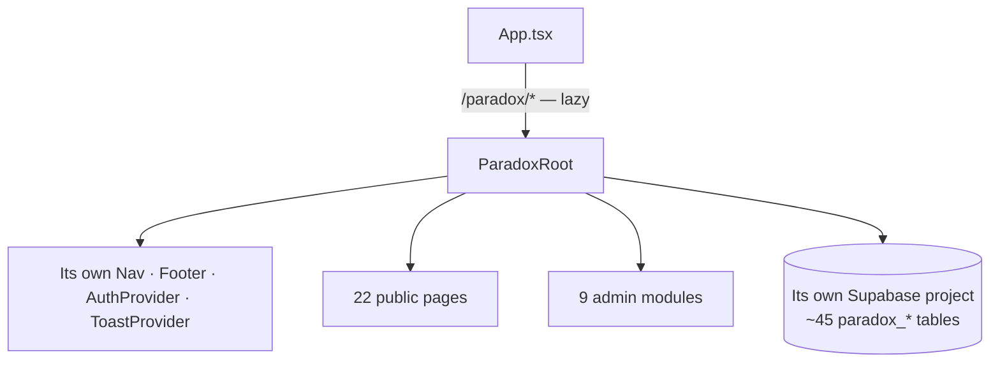

# Paradox Sub-App

A **separate product** living in the same repo. `/paradox/*`, mounted as one route
in `App.tsx`, lazy-loaded because it is the biggest single chunk win (~200 KB
gzipped).

> [!important] Three isolation boundaries — respect all of them
> **1. Its own Supabase project.** `paradox/lib/supabase.ts` reads
> `VITE_PARADOX_SUPABASE_URL` / `VITE_PARADOX_SUPABASE_ANON_KEY`, falling back to the
> community env vars if unset. The `paradox_*` tables were confirmed **absent** from
> the community project, so live it is genuinely separate.
> **2. Its own auth.** A separate `AuthProvider` and `paradox_admin_sessions` /
> `paradox_admin_permissions` — Paradox admins are not AquaTerra members.
> **3. Its own design system and motion toolkit.** `paradox.css`,
> `paradox/lib/motion.ts`, heavy framer-motion. Do not unify with either AquaTerra
> language ([[Two Design Languages]]).

## What it is

The annual **Paradox** event: an inter-school competition with registrations,
fixtures, judging, scores, winners, sponsors, ticketing, an after-party, a
photobooth, and a finance ledger.

## Public pages (22)

`Home` · `Story` · `Events` · `EventDetail` · `Schedule` · `Register` ·
`Ticket` · `Scores` · `Winners` · `Fixtures`-driven views · `Team` ·
`Volunteer` · `Sponsor` · `Updates` · `Blog` · `BlogDetail` · `AfterParty` ·
`Legacy` · `Contact` · `HowToUse` · `AdminLogin` · `Admin` · `NotFound`

## Admin modules (9) — `paradox/admin/`

| Module | Domain |
|---|---|
| `ControlRoom` | the operations hub |
| `FixturesModule` | brackets and match scheduling |
| `JudgingModule` | rubrics + scores (`paradox_judging_rubrics`, `paradox_judging_scores`) |
| `RecordsModule` | registrations and records |
| `CrmModules` | schools, inquiries, outreach |
| `CommsModule` | message templates and logs (`paradox_message_templates`, `paradox_message_log`) |
| `FinanceModule` | ledger, P&L, refunds (`paradox_ledger`, `paradox_pnl`, `paradox_refunds`) |
| `AnalyticsModule` | event analytics |
| `DoorCheckin` | on-the-day check-in |

## The `paradox_*` table families (~45)

| Family | Tables |
|---|---|
| People | `registrations`, `team_members`, `volunteers`, `schools`, `inquiries` |
| Competition | `events`, `events_list_v` (view), `fixtures`, `venues`, `stalls`, `scores`, `judging_rubrics`, `judging_scores`, `winners`, `certificates` |
| Money | `ledger`, `pnl`, `refunds`, `sponsors` |
| Comms | `message_templates`, `message_log`, `updates`, `blog_posts` |
| Ops | `logistics_items`, `requirements`, `runbook_steps`, `event_workspaces`, `site_settings`, `automation_log`, `audit_log` |
| Admin | `admin_sessions`, `admin_permissions`, `auth_users_view` |
| After-party | `afterparty_registrations` (with a phase constraint) |

## Notable engineering

`paradox/lib/offlineQueue.ts` — an offline mutation queue. That is the right call
for `DoorCheckin`: on event day, in a school hall, the network drops and check-in
must not.

`useWhatsAppGroup.ts` — WhatsApp is the org's real comms channel here too, same as
`volunteer_applications`' `texted`/`added` tracking ([[Intake Tables]]).

`paradox_os_*` naming (`paradox_os_greenlight`, `paradox_os_tick`) suggests a
runbook/automation engine — a state machine driving event-day readiness.

## The photobooth, and the three buckets

The **only** correctly configured storage in the whole system:

| Bucket | Public | Cap | MIME |
|---|---|---|---|
| `photobooth-raw-photos` | ❌ | 10 MB | `image/jpeg` only |
| `photobooth-print-sheets` | ❌ | 25 MB | `application/pdf` only |
| `photobooth-assets` | ✅ | — | — |

> [!tip] Copy this configuration to the four AquaTerra content buckets
> Private + size-capped + MIME-restricted is exactly what `post-images`,
> `avatars`, `project-images` and `post-documents` lack. See [[Storage Buckets]].

The **photobooth consumer** (whatever writes print sheets from raw photos) is
recorded as open technical debt by design.

## Working on it

Treat Paradox as a **vendored product**. It is not covered by AquaTerra's
`services/*` throw-on-error contract, its motion toolkit, its role model, or its
RLS helpers. Read `paradox/lib/` before changing anything, and do not import across
the boundary in either direction.

Its known debt is deliberately deferred — see [[Known Gaps and Debt]].

Related: [[Architecture Overview]] · [[Supabase Clients]] · [[Storage Buckets]]
